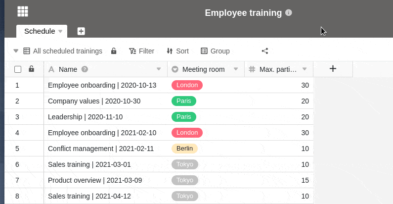
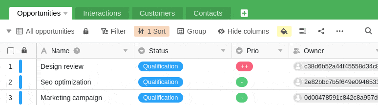



Pour permettre une collaboration optimale, vous pouvez partager des vues de tableaux avec les membres de votre équipe et d'autres utilisateurs. Lors du partage, vous pouvez décider si les autres utilisateurs peuvent uniquement lire la vue partagée ou s'ils peuvent également la modifier.

Si vous accordez à un autre utilisateur des droits de modification sur une vue partagée, il est autorisé à modifier toute entrée de la vue. Les modifications apportées seront également répercutées dans votre vue ou dans la vue de tous les utilisateurs avec lesquels vous avez partagé votre vue.

## Partage d'une vue avec un membre de l'équipe

1. Ouvrez la **vue** d'un tableau que vous souhaitez partager.
2. Cliquez sur **Partager la vue**, puis sélectionnez **Partager avec les utilisateurs**.
3. Sélectionnez un **utilisateur** avec lequel vous souhaitez partager la vue.
4. Dans le champ **Autorisation**, déterminez si le membre de votre équipe peut uniquement lire la vue ou s'il peut également la modifier.
5. **Nommez** le partage et confirmez-le en cliquant sur **Envoyer**.

Si vous avez réussi à partager la vue avec un autre utilisateur, elle apparaît sur sa page d'accueil sous l'onglet **Partagé avec moi**:

Lorsqu'un utilisateur ouvre une vue partagée avec lui, celle-ci peut par exemple se présenter comme suit :

## Résoudre une vue partagée

Si vous ne souhaitez plus partager une vue de tableau avec un autre utilisateur, vous pouvez facilement supprimer le partage :

1. Ouvrir la **vue** d'un tableau que vous avez partagé avec un autre utilisateur.
2. Cliquez sur **Partager la vue**.
3. Sous **Partage avec les utilisateurs**, sélectionnez le partage souhaité et appuyez sur **Supprimer**.

## Différence entre le partage d'une base entière et le partage d'une vue

Dans une base, il y a en tout deux **icônes de partage** avec lesquelles vous pouvez partager soit une base entière, soit une vue de tableau individuelle. En fonction de leur fonction, ces icônes se trouvent soit dans la zone **Options de la base** (ici en couleur), soit dans la zone **Options de la vue** (ici en blanc) :

### Partage d'une base

- L'ensemble de la base (y compris tous les **tableaux**, **vues** et **données**) est partagé avec un autre utilisateur.

### Partage d'une vue

- Seule la **vue** sélectionnée **d'un tableau** est partagée avec un autre utilisateur.

## Particularités

### Lors du partage d'une vue, il y a quelques particularités à prendre en compte :

- Les colonnes masquées dans une vue ne sont **pas** affichées aux personnes qui consultent le lien de partage.
- Si une vue de tableau partagée contient des liens vers les entrées d'un autre tableau que vous n'avez pas partagé avec l'utilisateur concerné, ce dernier peut tout de même **voir** les entrées correspondantes et, selon les droits que vous lui avez accordés pour la vue partagée, les **modifier**.
