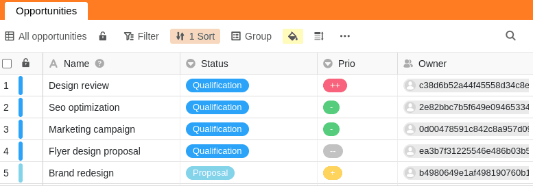



Para permitir uma colaboração óptima, pode partilhar as opiniões das tabelas com os membros da sua equipa e outros utilizadores. Ao partilhar, pode decidir se outros utilizadores só podem ler a visão partilhada ou também editá-la.

Se conceder a outro utilizador direitos de edição a uma visão partilhada, ele ou ela está autorizado a alterar quaisquer entradas na visão. As alterações correspondentes são então também aplicadas à sua opinião ou à opinião de todos os utilizadores a quem tenha partilhado a sua opinião.

## Partilhar uma visão com um membro da equipa

1. Abra a **vista de** uma mesa que deseja partilhar.
2. Clique em **Share View** e depois seleccione Share with **User**.
3. Seleccione um **utilizador** a quem deseja partilhar a visão.
4. No campo **Autorização**, decidir se o membro da sua equipa só pode ler a vista ou também editá-la.
5. **Nomear a** libertação e confirmar com **Submeter**.

Se partilhou com sucesso a visão com outro utilizador, esta aparece na sua página inicial sob o separador **Partilhado comigo**:

Se um utilizador abre uma visão que foi partilhada com ele, pode ser assim, por exemplo:

## Resolver uma visão dividida

Se já não quiser partilhar uma vista de tabela com outro utilizador, pode apagar facilmente a partilha novamente:

1. Abra a **vista de** uma tabela que tenha partilhado com outro utilizador.
2. Clique em **Share View**.
3. Em Partilhar com o **Utilizador**, seleccionar a partilha desejada e premir **Apagar**.

## Diferença entre partilhar uma base inteira e partilhar um ponto de vista

Numa base há um total de dois **ícones de partilha** com os quais se pode partilhar tanto uma vista de base inteira como uma vista de mesa individual. Dependendo da sua função, encontrará estes ícones ou na área das **Opções Base** (aqui com fundo colorido) ou na área das **Opções de Visualização** (aqui branco):

### Lançamento de uma base

- Toda a base (incluindo todas as **tabelas**, **vistas** e **dados**) é divulgada a outro utilizador.

### Libertação de uma vista

- Apenas a **vista** seleccionada **de uma tabela** é divulgada a outro utilizador.

## Características especiais

### Ao libertar uma vista, há algumas características especiais que precisam de ser tidas em conta:

- As colunas ocultas numa vista **não** são mostradas aos telespectadores da ligação da acção.
- Se uma vista de tabela partilhada contiver links para as entradas de outra tabela que não tenha partilhado com o respectivo utilizador, o utilizador ainda pode **ver** as entradas correspondentes e, dependendo dos direitos que lhe tenha concedido para a vista partilhada, **editá-las** também.
