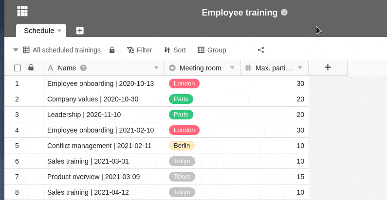
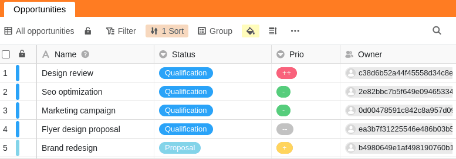
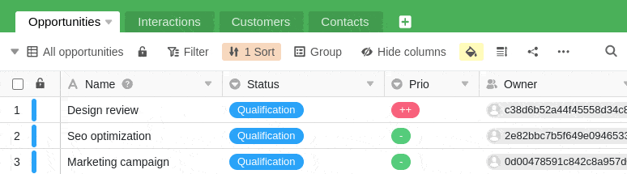
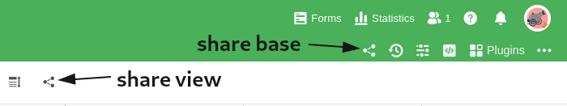



Para permitir uma colaboração ótima, pode partilhar vistas de tabelas com os membros da sua equipa e com outros utilizadores. Ao partilhar, pode decidir se os outros utilizadores só podem ler a vista partilhada ou também editá-la.

Se conceder a outro utilizador direitos de edição sobre uma vista partilhada, este fica autorizado a alterar quaisquer entradas na vista. As alterações correspondentes são depois aplicadas também à sua vista e à vista de todos os utilizadores com quem partilhou a sua vista.

## Partilhar uma vista com um membro da equipa

1. Abra a **vista** de uma tabela que deseja partilhar.
2. Clique em **Partilhar vista** e depois selecione **Partilhar com utilizador**.
3. Selecione um **utilizador** com quem deseja partilhar a vista.
4. No campo **Autorização**, decida se o membro da sua equipa só pode ler a vista ou também editá-la.
5. **Nomeie** a partilha e confirme com **Submeter**.

Se tiver partilhado com sucesso a vista com outro utilizador, esta aparece na página inicial dele sob o separador **Partilhado comigo**:

Quando um utilizador abre uma vista que foi partilhada com ele, esta pode ter o seguinte aspeto, por exemplo:

## Anular a partilha de uma vista

Se já não quiser partilhar uma vista de tabela com outro utilizador, pode apagar facilmente a partilha:

1. Abra a **vista** de uma tabela que tenha partilhado com outro utilizador.
2. Clique em **Partilhar vista**.
3. Em **Partilhar com utilizador**, selecione a partilha desejada e prima **Apagar**.

## Diferença entre partilhar uma base inteira e partilhar uma vista

Numa base há um total de dois **ícones de partilha** com os quais pode partilhar uma base inteira ou uma vista de tabela individual. Consoante a sua função, encontra estes ícones na área das **Opções da base** (aqui com fundo colorido) ou na área das **Opções de vista** (aqui a branco):

### Partilha de uma base

- Toda a base (incluindo todas as **tabelas**, **vistas** e **dados**) é partilhada com outro utilizador.

### Partilha de uma vista

- Apenas a **vista de uma tabela** selecionada é partilhada com outro utilizador.

## Particularidades

Ao partilhar uma vista há algumas particularidades a ter em conta:

- As colunas ocultas numa vista **não** são mostradas a quem abre a ligação de partilha.
- Se uma vista de tabela partilhada contiver ligações para as entradas de outra tabela que não tenha partilhado com o respetivo utilizador, este pode ainda assim **ver** as entradas correspondentes e, consoante os direitos que lhe tenha concedido para a vista partilhada, também **editá-las**.
