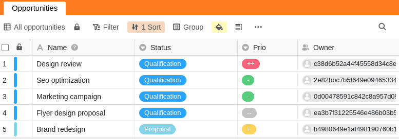



Чтобы обеспечить оптимальную совместную работу, вы можете делиться представлениями таблиц с членами вашей команды и другими пользователями. При совместном использовании вы можете решить, могут ли другие пользователи только читать общее представление или также редактировать его.

Если вы предоставите другому пользователю права редактирования общего представления, он или она получит право изменять любые записи в этом представлении. Соответствующие изменения затем также применяются к вашему представлению или к представлению всех пользователей, которым вы поделились своим представлением.

## Обмен мнениями с членом команды

1. Откройте **представление** таблицы, к которой вы хотите предоставить общий доступ.
2. Нажмите **Share View** и затем выберите Share with **User**.
3. Выберите **пользователя**, которому вы хотите предоставить общий доступ к представлению.
4. В поле **Авторизация** решите, может ли член вашей команды только читать представление или также редактировать его.
5. **Назовите** релиз и подтвердите его с помощью кнопки **Submit**.

Если вы успешно поделились представлением с другим пользователем, оно появится на его домашней странице на вкладке **Shared with me**:

Если пользователь открывает представление, которое было ему предоставлено, оно может выглядеть, например, следующим образом:

## Разрешить разделенный вид

Если вы больше не хотите предоставлять общий доступ к представлению таблицы другому пользователю, вы можете легко удалить общий доступ снова:

1. Откройте **представление** таблицы, которое вы разделили с другим пользователем.
2. Щелкните на **Share View (Просмотр общего доступа**).
3. В разделе Поделиться с **пользователем** выберите нужный общий ресурс и нажмите **Удалить**.

## Разница между совместным использованием всей базы и совместным использованием вида

В базе есть два **значка общего доступа**, с помощью которых можно открыть общий доступ либо ко всей базе, либо к отдельному виду таблицы. В зависимости от функции, эти значки находятся либо в области **базовых параметров** (здесь цветной фон), либо в области **параметров просмотра** (здесь белый):

### Освобождение базы

- Вся база (включая все **таблицы**, **представления** и **данные**) передается другому пользователю.

### Освобождение вида

- Только выбранное **представление таблицы** доступно другому пользователю.

## Специальные возможности

### При выпуске вида есть некоторые особенности, которые необходимо учитывать:

- Колонки, скрытые в представлении, **не** отображаются для зрителей ссылки общего доступа.
- Если общее представление таблицы содержит ссылки на записи другой таблицы, которые вы не предоставили соответствующему пользователю, пользователь все равно может **видеть** соответствующие записи и, в зависимости от прав, которые вы предоставили ему для общего представления, также **редактировать** их.
