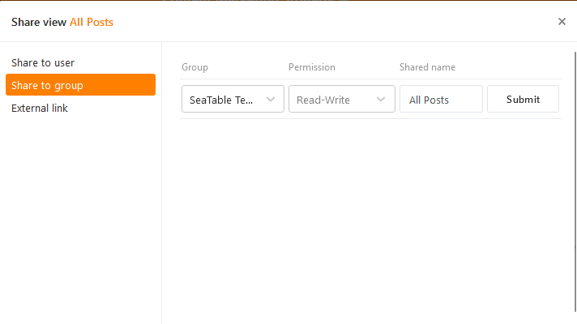



To enable optimal collaboration, you can **share** **views of** tables not only with individual users, but also **with entire groups**. When sharing, you can decide whether the group members can only **read** the shared view or also **edit** it.

For detailed explanations about view sharing, see the article [Sharing a view with a team member]().

## To share a view with a group

1. Open the **view of** a table you want to share.
2. Click **Share View**  and then select **Share with Group**.

4. Select a **group** you want to share the view with.
5. Decide in the **Permission** field whether the group members can only read the view or also edit it.
6. **Name the** release and confirm it with **Submit**.

If you have successfully shared the view with a group, it will appear with the name suffix **Shared** with all group members in the area of the corresponding group on the **Home** page.

