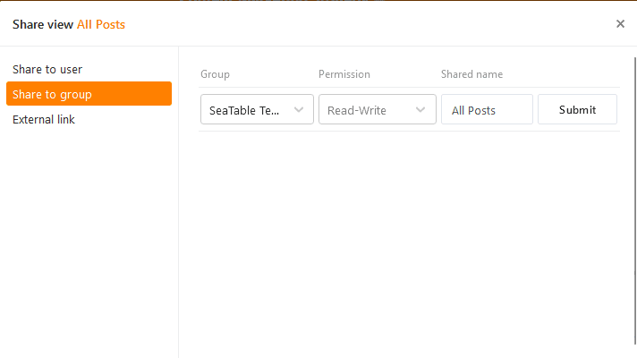



Para permitir una colaboración óptima, puede **compartir vistas** de tablas no solo con usuarios individuales, sino también **con grupos enteros**. Al compartir, puede decidir si los miembros del grupo solo pueden **leer** la vista compartida o también **editarla**.

Para obtener explicaciones detalladas sobre el uso compartido de vistas, consulte el artículo [Compartir una vista con un miembro del equipo]().

## Para compartir una vista con un grupo

1. Abra la **vista** de una tabla que desee compartir.
2. Haga clic en **Compartir vista**  y, a continuación, seleccione **Compartir con grupo**.

3. Seleccione un **grupo** con el que compartir la vista.
4. Decida en el campo **Permiso** si los miembros del grupo solo pueden leer la vista o también editarla.
5. **Nombre** la compartición y confírmela con **Enviar**.

Si ha compartido correctamente la vista con un grupo, aparecerá con el nombre añadido **Compartida** para todos los miembros del grupo en el área del grupo correspondiente en la **página de inicio**.

