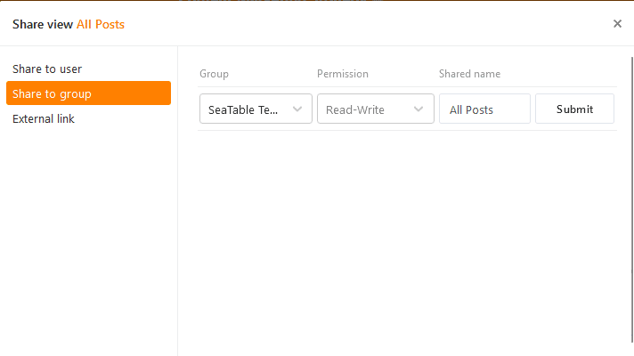



Pour permettre une collaboration optimale, vous pouvez **partager** **des vues** de tableaux non seulement avec des utilisateurs individuels, mais aussi **avec des groupes entiers**. Lors du partage, vous pouvez décider si les membres du groupe peuvent uniquement **lire la** vue partagée ou s'ils peuvent également la **modifier**.

Vous trouverez des explications détaillées sur le partage de vues dans l'article [Partager une vue avec un membre de l'équipe](https://seatable.io/fr/docs/ansichtsfreigaben/freigabe-einer-ansicht-an-ein-teammitglied/).

## Pour partager une vue avec un groupe

1. Ouvrez la **vue** d'un tableau que vous souhaitez partager.
2. Cliquez sur **Partager l'affichage** , puis sélectionnez **Partager avec le groupe**.

4. Sélectionnez un **groupe** avec lequel vous souhaitez partager la vue.
5. Dans le champ **Autorisation**, décidez si les membres du groupe peuvent uniquement lire la vue ou s'ils peuvent également la modifier.
6. **Nommez** le partage et confirmez-le en cliquant sur **Envoyer**.

Si vous avez partagé avec succès la vue avec un groupe, elle apparaît avec le suffixe " **Partagé** " pour tous les membres du groupe dans la zone du groupe correspondant sur la **page d'accueil**.

