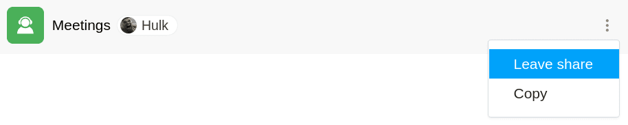

If another user has shared a base with you, you can **leave this share**. This is possible at any time with just a few clicks via the start page.

## Leaving a shared base

1. Switch to the SeaTable **home page**.
2. Move the mouse pointer to the **Base** and click the **three dots** that appear on the right .
3. Click **Exit Share**.

## Impact

If you exit a share by yourself in the way described above, you **lose access to any data** in the shared Base. However, **any changes** you made in Base **before** exiting the share will still be **saved** in the Base.
