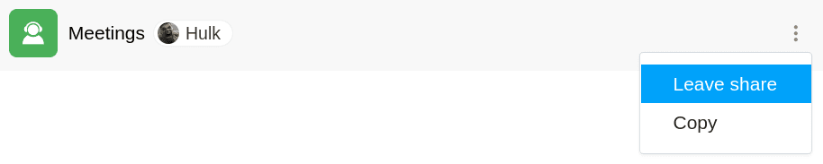

Si un autre utilisateur a partagé une base avec vous, vous pouvez **quitter** ce **partage** de votre propre initiative. Cela est possible à tout moment en quelques clics depuis la page d'accueil.

## Quitter une base partagée

1. Passez à la **page d'accueil** de SeaTable.
2. Déplacez le curseur de la souris sur la **base que vous avez partagée** et cliquez sur les **trois points** qui apparaissent à droite .
3. Cliquez sur **Quitter le partage**.

## Conséquences

Si vous quittez un partage de votre propre initiative en suivant la procédure décrite ci-dessus, vous **perdez** l'**accès à toutes les données** de la base partagée. Cependant, **toutes les modifications** que vous avez effectuées dans la base **avant** de quitter le partage restent **enregistrées** dans la base.
