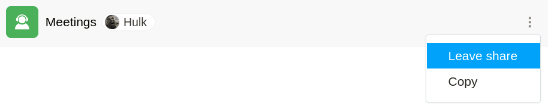

Если другой пользователь предоставил вам доступ к базе, вы можете **самостоятельно покинуть этот общий доступ**. Это возможно в любое время с помощью нескольких щелчков мыши на домашней странице.

## Выход из общей базы

1. Перейдите на **домашнюю страницу** SeaTable.
2. Переместите указатель мыши на **базу, к которой вам предоставили доступ**, и нажмите на **три точки**, появившиеся справа .
3. Нажмите кнопку **Выйти из общего доступа**.

## Последствия

Если вы самостоятельно прекращаете общий доступ описанным выше способом, вы **теряете доступ к любым данным** в общей базе. Однако **все изменения**, которые вы внесли в базу **до** выхода из общего доступа, будут **сохранены** в базе.
