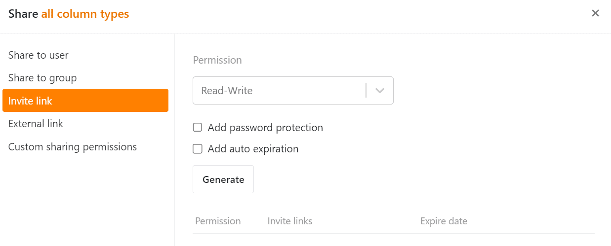

Both sharing types allow you to collaborate with **external people** **without adding them to your team**.

## External links

You can send an [external link to](https://seatable.io/en/docs/freigabelinks/einladungs-link-erklaert/) other people **without** requiring them to have a **SeaTable account**. Thus, an external link for a Base is a **public link** that grants **read access** to a Base. You can also use an external link to embed a Base in a web page.

## Invitation links

The [invitation link](https://seatable.io/en/docs/freigabelinks/einladungs-link-erklaert/) allows you to share Bases with **existing** SeaTable users as well as with external people who do **not yet** have **an account**. However, to open the link and the associated base, the recipient must either **log in** to SeaTable or **register**. The link can grant **read and write** permissions.

