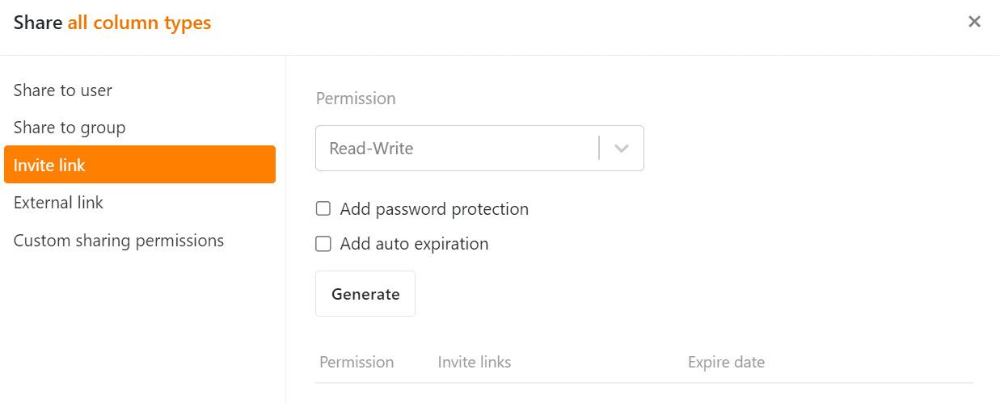

Ambos tipos de uso compartido te permiten colaborar con **personas externas** **sin añadirlas a tu equipo**.

## Enlaces externos

Puede enviar un [enlace externo a]() otras personas **sin** que necesiten una **cuenta de SeaTable**. Un enlace externo para una base es, por tanto, un **enlace público** que concede **acceso de lectura a** una base. También puede utilizar un enlace externo para incrustar una Base en una página web.

## Enlaces de invitación

El [enlace de invitación]() le permite compartir bases con usuarios **existentes** de SeaTable, así como con personas externas que **aún no** tienen **una cuenta**. Sin embargo, para abrir el enlace y la base asociada, el destinatario debe **iniciar** sesión en SeaTable o **registrarse**. El enlace puede conceder permisos de **lectura y escritura**.

