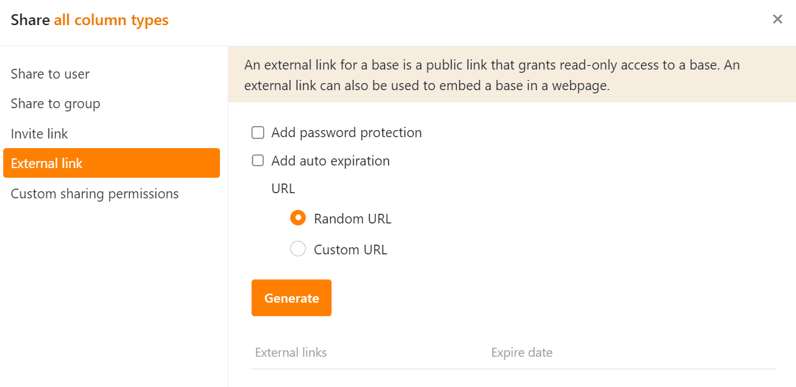
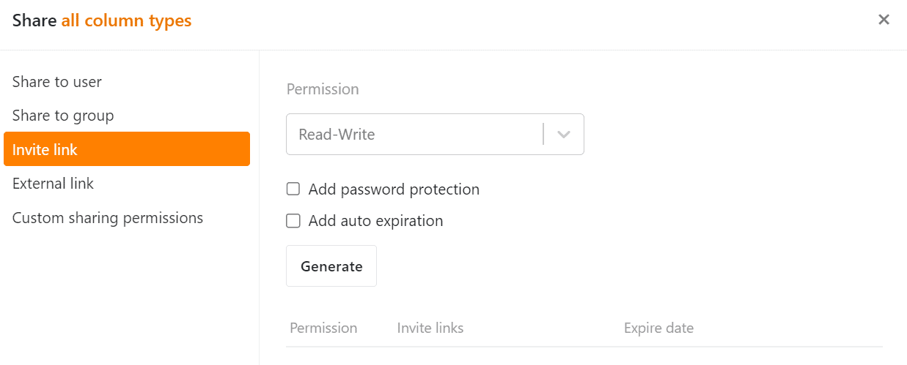

Ambos os tipos de partilha permitem-lhe colaborar com **pessoas externas** **sem as adicionar à sua equipa**.

## Links externos

Pode enviar um [link externo]() a outras pessoas **sem** que elas precisem de uma **conta SeaTable**. Um link externo para uma base é, portanto, um **link público** que concede **acesso de leitura** a uma base. Também pode utilizar um link externo para incorporar uma base numa página web.

## Links de convite

O [link de convite]() permite-lhe partilhar bases com utilizadores **existentes** do SeaTable, bem como com pessoas externas que **ainda não** têm **uma conta**. No entanto, para abrir o link e a base associada, o destinatário tem de **iniciar sessão** no SeaTable ou **registar-se**. O link pode conceder permissões de **leitura e escrita**.

