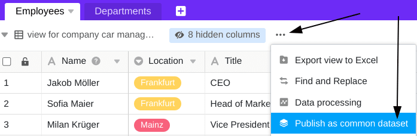

In each base belonging to a group, you can create a table view as a **common dataset**. The prerequisite for this is that you are the owner or administrator of the group (and not just a member). You can then import the common dataset, including its specific filtering and sorting conditions, as a new table into any other base in the group.



## Creating a common dataset

  

1. Open any **table view** in a base that belongs to one of your groups.
2. Click on the **three dots**.
3. Click **Publish as common dataset**.
4. **Name** the common dataset.
5. Confirm with **Submit**.

## Overview of all common datasets

You will find all the common datasets that you have created and that have been shared with you on the start page under **common datasets**.

