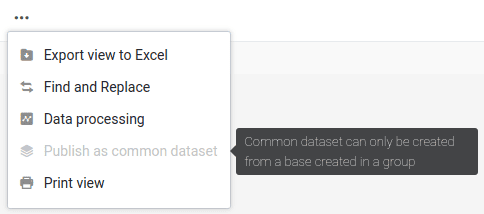
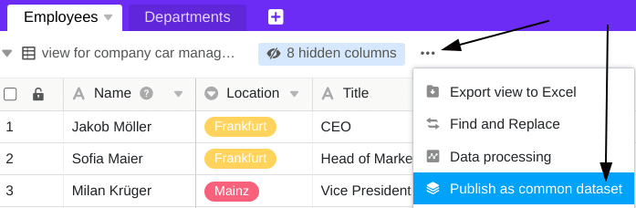
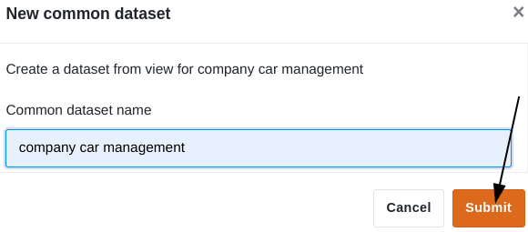
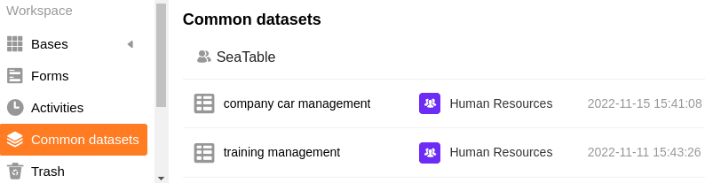

Dans chaque base appartenant à un groupe, vous pouvez créer une vue de table comme **jeu de données commun**. Pour cela, vous devez être propriétaire ou administrateur du groupe (et pas seulement membre). Vous pouvez ensuite importer le jeu de données commun, y compris ses conditions de filtrage et de tri spécifiques, en tant que nouveau tableau dans n'importe quelle autre base du groupe.



## Création d'un jeu de données commun

  

1. Ouvrez n'importe quelle **vue de tableau** dans une base appartenant à l'un de vos groupes.
2. Cliquez sur les **trois points**.
3. Cliquez sur **Publier en tant que jeu de données commun**.
4. **Nommez** le jeu de données commun.
5. Confirmez en cliquant sur **Envoyer**.

## Aperçu de tous les jeux de données communs

Vous trouverez tous les jeux de données partagées que vous avez créés et partagés avec vous sur la page d'accueil sous **Jeu de données partagées**.

