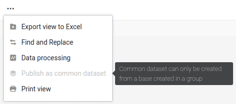
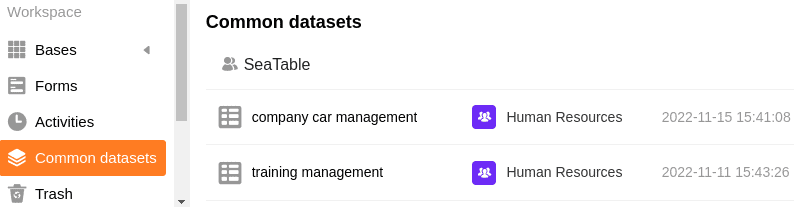

Em cada base pertencente a um grupo, pode-se criar uma vista de tabela como um **registo comum**. O pré-requisito para tal é que seja o proprietário ou administrador do grupo (e não apenas um membro). Poderá então importar o conjunto de dados partilhados, incluindo o seu filtro específico e condições de classificação, como uma nova tabela para qualquer outra base do grupo.



## Criação de um conjunto de dados comum

  

1. Abra qualquer **vista de mesa** numa Base que pertença a um dos seus grupos.
2. Clique sobre os **três pontos**.
3. Clique em **Publish as Shared Record (Publicar como Registo Partilhado**).
4. **Nomear** o registo comum.
5. Confirmar com **Submeter**.

## Visão geral de todos os conjuntos de dados comuns

Encontrará todos os registos de dados partilhados que criou e que lhe foram atribuídos na página inicial, em **Registo de dados partilhados**.

