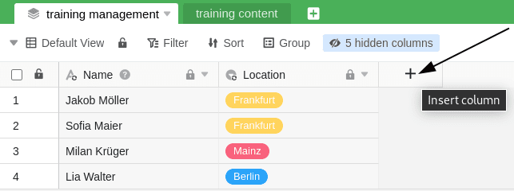

Tabellen, die Sie mit einem gemeinsamen Datensatz angelegt haben, enthalten zu Beginn alle Spalten und Zeilen, die auch in der Tabellenansicht des gemeinsamen Datensatzes zu finden sind. Darüber hinaus haben Sie selbstverständlich die Möglichkeit, diese Tabellen um **neue Spalten** zu erweitern und zusätzlich mit eigenen Daten zu befüllen. Der Vorteil: Daten in Spalten, die nicht mit dem gemeinsamen Datensatz verknüpft sind, werden bei der [Synchronisation](https://seatable.io/docs/gemeinsame-datensaetze/synchronisation-eines-gemeinsamen-datensatzes/) **nicht überschrieben**.

Diese Funktion macht es möglich, dass gemeinsame Datensätze beispielsweise von mehreren Abteilungen und Mitarbeitergruppen eines Unternehmens in verschiedensten Kontexten genutzt werden können.

## Eine mit einem gemeinsamen Datensatz erstellte Tabelle um Spalten erweitern

Das Hinzufügen von Spalten funktioniert **genauso wie bei üblichen Tabellen**. Eine detaillierte Klickanleitung finden Sie [hier](https://seatable.io/docs/arbeiten-mit-spalten/hinzufuegen-einer-spalte/).

## Sperren von Spalten des gemeinsamen Datensatzes

Bei der Bearbeitung von Spalten eines gemeinsamen Datensatzes ist **Vorsicht geboten**. Wenn Sie in Spalten, die Daten eines gemeinsamen Datensatzes enthalten, Änderungen vornehmen, werden diese bei der nächsten [Synchronisation des Datensatzes](https://seatable.io/docs/gemeinsame-datensaetze/synchronisation-eines-gemeinsamen-datensatzes/) wieder **überschrieben** und gehen somit **verloren**.

Um einen optimalen Workflow zu gewährleisten und sowohl einen Datenverlust als auch Missverständnisse bei der Zusammenarbeit zu vermeiden, empfiehlt es sich, alle **Spalten**, die Daten eines **gemeinsamen Datensatzes** enthalten, für die Bearbeitung zu **sperren**. Die **individuell** hinzugefügten zusätzlichen Spalten können Sie hingegen beliebig bearbeiten.

1. Klicken Sie auf das **Dreieck-Symbol** einer Spalte, die Sie für die Bearbeitung sperren möchten.
2. Klicken Sie auf **Spaltenberechtigungen bearbeiten**.
3. Wählen Sie aus, für wen Sie die **Bearbeitung der Zellen** einschränken möchten.
4. Bei Einfach- und Mehrfachauswahlspalten können Sie zusätzlich das **Anlegen von Optionen** einschränken.

Die Bearbeitung können Sie bei jeder Spalte individuell einschränken, sodass Sie stets entscheiden können, ob diese lediglich von **Administratoren**, von **bestimmten Nutzern** oder von gar **keinem** bearbeitet werden kann.

Eine Sperrung der Spalte verhindert dabei grundsätzlich die **Bearbeitung der Zellen**. Bei bestimmten Spaltentypen wie zum Beispiel der **Einfach-** oder **Mehrfachauswahl** ist es darüber hinaus möglich, auch das **Anlegen von Optionen** einzuschränken.

