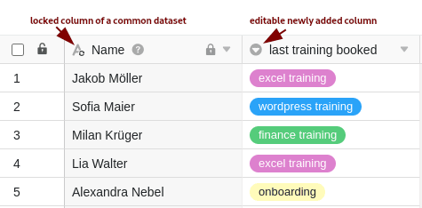

Tables that you have created with a common dataset initially contain all columns and rows that can also be found in the table view of the common dataset. Of course, you also have the option of adding **new columns** to these tables and filling them with your own data. The advantage: data in columns that are not linked to the common dataset are **not overwritten** during [synchronization]().

This function makes it possible, for example, for common datasets to be used by multiple departments and employee groups within a company in a wide variety of contexts.

## Add columns to a table created with a common dataset

Adding columns works the **same way as with usual tables**. You can find detailed click instructions [here]().

## Locking columns of the common dataset

**Care must be taken** when editing columns of a common dataset. If you make changes in columns containing data of a common dataset, these changes will be **overwritten** again during the next [synchronization of the data set]() and will thus be **lost**.

To ensure an optimal workflow and to avoid both data loss and misunderstandings during collaboration, it is recommended to **lock** all **columns** containing data of a **common dataset for** editing. On the other hand, you can edit the **individually** added additional columns as you wish.

1. Click the **triangle icon of** a column you want to lock for editing.
2. Click **column permissions edit**.
3. Select for whom you want to restrict the **editing of the cells**.
4. For single and multiple selection columns, you can additionally restrict the **creation of options**.

You can restrict editing for each column individually, so you can always decide whether it can be edited only by **administrators**, by **certain users** or by **no one** at all.

Locking the column basically prevents the **cells from being edited**. For certain column types, such as **single** or **multiple selection**, it is also possible to restrict the **creation of options**.

