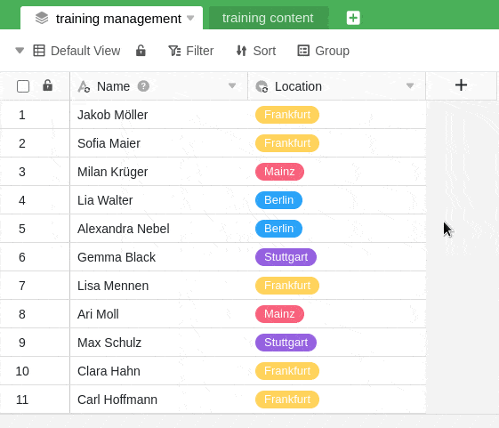
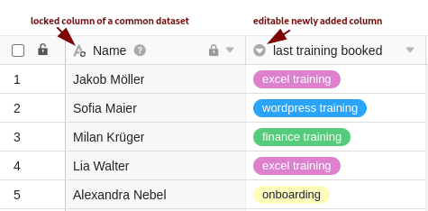

Las tablas que ha creado con un registro de datos compartido contienen inicialmente todas las columnas y filas que también se pueden encontrar en la vista de tabla del registro de datos compartido. Por supuesto, también tiene la opción de añadir **nuevas columnas** a estas tablas y rellenarlas con sus propios datos. La ventaja: los datos de las columnas que no están vinculadas a la base de datos compartida **no se sobrescriben** durante [la sincronización]().

Esta función hace posible que los conjuntos de datos comunes sean utilizados, por ejemplo, por varios departamentos y grupos de empleados de una empresa en contextos muy diversos.

## Añadir columnas a una tabla creada con un conjunto de datos común

La adición de columnas funciona del **mismo modo que con las tablas habituales**. Encontrará instrucciones detalladas para hacer clic [aquí]().

## Bloqueo de columnas del registro común

Hay **que tener cuidado** al editar columnas de un conjunto de datos común. Si realiza cambios en columnas que contienen datos de un conjunto de datos común, estos cambios se **sobrescribirán** de nuevo la próxima vez que [se sincronice]() el [conjunto de]() datos y, por tanto, se **perderán**.

Para garantizar un flujo de trabajo óptimo y evitar tanto la pérdida de datos como los malentendidos durante la colaboración, es aconsejable **bloquear** todas las **columnas** que contengan datos de un **conjunto de datos común para su** edición. No obstante, puede editar como desee las columnas adicionales añadidas **individualmente**.

1. Haga clic en el **símbolo del triángulo de** una columna que desee bloquear para su edición.
2. Haga clic en **Editar permisos de columna**.
3. Seleccione para quién desea restringir la **edición de las celdas**.
4. Para las columnas de selección simple y múltiple, puede restringir adicionalmente la **creación de opciones**.

Puede restringir la edición de cada columna individualmente, de modo que siempre puede decidir si sólo puede ser editada por **administradores**, por **determinados usuarios** o por **nadie** en absoluto.

El bloqueo de la columna impide básicamente la **edición de las celdas**. Con determinados tipos de columna, como la **selección** **única** o **múltiple**, también es posible restringir la **creación de opciones**.

