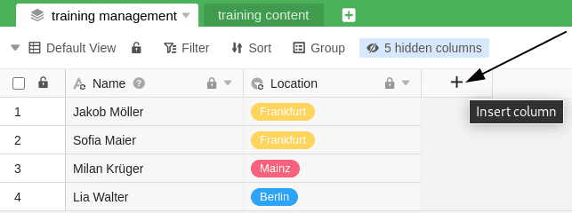

Les tableaux que vous avez créés avec un ensemble de données commun contiennent au départ toutes les colonnes et lignes qui se trouvent également dans la vue tableau de l'ensemble de données commun. En outre, vous avez bien entendu la possibilité d'ajouter **de nouvelles colonnes** à ces tableaux et de les remplir avec vos propres données. L'avantage : les données des colonnes qui ne sont pas liées à l'ensemble de données commun ne sont **pas écrasées** lors de la [synchronisation](https://seatable.io/fr/docs/gemeinsame-datensaetze/synchronisation-eines-gemeinsamen-datensatzes/).

Cette fonction permet d'utiliser des ensembles de données communs, par exemple, par plusieurs services et groupes de collaborateurs d'une entreprise dans les contextes les plus divers.

## Ajouter des colonnes à une table créée avec un enregistrement commun

L'ajout de colonnes fonctionne **de la même manière que pour les tableaux habituels**. Vous trouverez [ici]() des instructions détaillées pour cliquer.

## Verrouillage des colonnes de l'ensemble de données commun

Il **convient d'être prudent** lors de la modification des colonnes d'un ensemble de données commun. Si vous effectuez des modifications dans des colonnes contenant des données d'un ensemble de données commun, celles-ci seront **écrasées** lors de la prochaine [synchronisation de l'ensemble de données](https://seatable.io/fr/docs/gemeinsame-datensaetze/synchronisation-eines-gemeinsamen-datensatzes/) et seront donc **perdues**.

Afin de garantir un flux de travail optimal et d'éviter aussi bien une perte de données que des malentendus lors de la collaboration, il est recommandé de **bloquer** pour l'édition toutes les **colonnes** qui contiennent des données d'un **enregistrement commun**. En revanche, les colonnes supplémentaires ajoutées **individuellement** peuvent être modifiées à volonté.

1. Cliquez sur l'**icône triangulaire** d'une colonne dont vous souhaitez bloquer l'édition.
2. Cliquez sur **Modifier les autorisations de colonne**.
3. Sélectionnez les personnes pour lesquelles vous souhaitez restreindre l'**édition des cellules**.
4. Pour les colonnes à sélection unique et multiple, vous pouvez en outre limiter la **création d'options**.

Vous pouvez limiter individuellement l'édition de chaque colonne, de sorte que vous pouvez toujours décider si elle ne peut être modifiée que par les **administrateurs**, par **certains utilisateurs** ou par **personne**.

Un blocage de la colonne empêche en principe l'**édition des cellules**. Pour certains types de colonnes, comme par exemple la sélection **simple** ou **multiple**, il est en outre possible de restreindre la **création d'options**.

