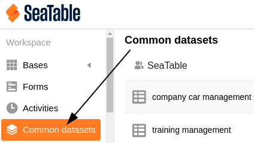

Sie können gemeinsame Datensätze nicht nur in der jeweiligen Gruppe nutzen, in der Sie sie erstellt haben, sondern auch an andere Gruppen freigeben. Auf diesem Weg haben weitere Nutzer die Möglichkeit, auf die Daten des gemeinsamen Datensatzes zuzugreifen. Diese sind folglich dazu in der Lage, mit dem gemeinsamen Datensatz zu arbeiten und eine neue Tabelle anzulegen. Die Freigabe eines gemeinsamen Datensatzes an eine andere Gruppe erfolgt über die Startseite.

## Freigabe eines gemeinsamen Datensatzes an eine andere Gruppe

1. Öffnen Sie die **Startseite** von SeaTable.
2. Klicken Sie auf den Reiter **Gemeinsamer Datensatz**.
3. Wählen Sie den gemeinsamen Datensatz aus, den Sie an eine andere Gruppe **freigeben** möchten.
4. Klicken Sie auf die **drei Punkte** rechts neben dem entsprechenden Datensatz und anschließend auf **Zugriff verwalten**.
5. Wählen Sie eine **Gruppe** aus, an die der Datensatz freigegeben werden soll.
6. Bestätigen Sie die Freigabe mit einem Klick auf **Hinzufügen**.

## Freigabe auflösen

Um die Freigabe eines gemeinsamen Datensatzes an eine andere Gruppe wieder **aufzulösen**, folgen Sie einfach erneut den oben genannten Schritten und klicken bei den Zugriffsberechtigungen neben der entsprechenden Gruppe auf **Löschen**.

### Folgen der Auflösung

Wird die Freigabe eines gemeinsamen Datensatzes an eine andere Gruppe **aufgelöst**, bleiben die mit dem gemeinsamen Datensatz **erstellten Tabellen** in dieser Gruppe weiter erhalten. Die Gruppe ist folglich trotz der Auflösung **weiterhin** dazu in der Lage, mit den bereits vorhandenen Daten in den Tabellen zu **arbeiten**.

Die **Synchronisationsmöglichkeit** mit dem gemeinsamen Datensatz steht der Gruppe nach Auflösung der Freigabe jedoch **nicht** mehr zur Verfügung, sodass Änderungen am gemeinsamen Datensatz für diese Gruppe **nicht** mehr sichtbar werden. Die Mitglieder der Gruppe haben somit nur noch Zugriff auf die letzte Version des gemeinsamen Datensatzes **vor** der Auflösung der Freigabe.
