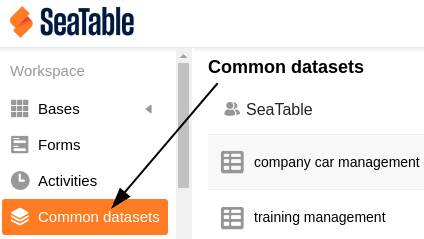
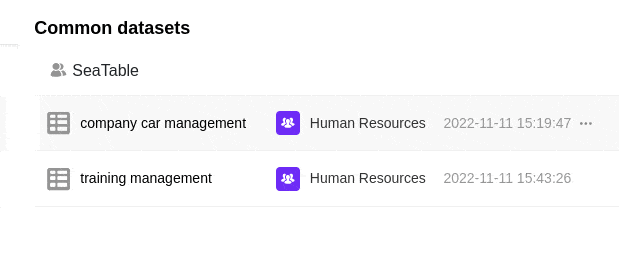
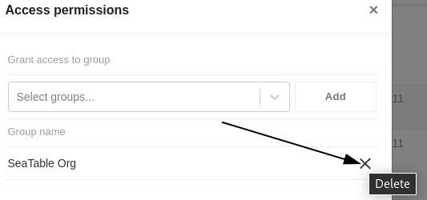

You can not only use common datasets in the respective group in which you created them, but also share them with other groups. In this way, other users have the opportunity to access the data of the common dataset. They are then able to work with the common dataset and create a new table. A common dataset is shared with another group via the start page.

## Sharing a common dataset with another group

 

1. Open the **home page** of SeaTable. 
2. Click on the **common dataset** tab. 
3. Select the common dataset that you want to **share** with another group. 
4. Click on the **three dots** to the right of the corresponding dataset and then on **Manage access**. 
5. Select a **group** with which the dataset should be shared. 
6. Confirm by clicking on **Add**.

## Dissolve share

To **cancel** the share of a common dataset to another group, simply follow the steps above again and click **Delete** next to the corresponding group in the access authorizations.

### Consequences of the dissolution

If a common dataset **is shared** with another group, the **tables created** with the common dataset are retained in this group. The group is therefore **still** able to **work** with the existing data in the tables despite the dissolution.

However, the **synchronization option** with the common dataset is **no longer available** to the group once the share has been deleted, meaning that changes to the common dataset are **no longer visible** to this group. The members of the group therefore only have access to the last version of the common dataset **before** the share was deleted.
