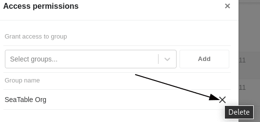

Vous pouvez non seulement utiliser les enregistrements partagés dans le groupe dans lequel vous les avez créés, mais aussi les partager avec d'autres groupes. De cette manière, d'autres utilisateurs ont la possibilité d'accéder aux données de l'ensemble de données partagé. Ils pourront ainsi travailler avec l'ensemble de données partagé et créer une nouvelle table. Le partage d'un ensemble de données commun avec un autre groupe s'effectue via la page d'accueil.

## Partage d'un ensemble de données commun avec un autre groupe

 

1. Ouvrez la **page d'accueil** de SeaTable. 
2. Cliquez sur l'onglet **Enregistrement partagé**. 
3. Sélectionnez l'enregistrement partagé que vous souhaitez **partager** avec un autre groupe. 
4. Cliquez sur les **trois points** à droite de l'enregistrement concerné, puis sur **Gérer l'accès**. 
5. Sélectionnez un **groupe** avec lequel l'enregistrement doit être partagé. 
6. Confirmez le partage en cliquant sur **Ajouter**.

## Résoudre le partage

Pour **annuler** le partage d'un enregistrement commun avec un autre groupe, il suffit de suivre à nouveau les étapes ci-dessus et de cliquer sur **Supprimer** dans les autorisations d'accès à côté du groupe concerné.

### Conséquences de la dissolution

Si le partage d'un ensemble de données commun avec un autre groupe **est dissous**, les **tables créées** avec l'ensemble de données commun sont conservées dans ce groupe. Par conséquent, malgré la dissolution, le groupe peut **continuer** à **travailler** avec les données existantes dans les tables.

Toutefois, la **possibilité de synchronisation** avec l'ensemble de données commun n'est **plus** disponible pour le groupe après la dissolution du partage, de sorte que les modifications apportées à l'ensemble de données commun ne sont **plus** visibles pour ce groupe. Les membres du groupe n'ont donc plus accès qu'à la dernière version de l'ensemble de données commun **avant** la dissolution du partage.
