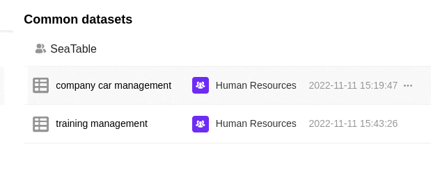

Общие записи данных можно использовать не только в той группе, в которой вы их создали, но и предоставлять их другим группам. Таким образом, другие пользователи могут получить доступ к данным в общей записи данных. Они могут работать с общей записью данных и создавать новые таблицы. Общая запись данных передается другой группе через стартовую страницу.

## Совместное использование общей записи с другой группой

 

1. Откройте **стартовую** страницу SeaTable. 
2. Перейдите на вкладку " **Общая запись"**. 
3. Выберите запись общих данных, которую вы хотите **передать** другой группе. 
4. Нажмите на **три точки** справа от соответствующей записи данных, а затем на **Управление доступом**. 
5. Выберите **группу**, для которой будет выпущена запись. 
6. Подтвердите освобождение, нажав на кнопку **Добавить**.

## Растворение релиза

Чтобы **отменить** передачу записи общих данных другой группе, просто выполните описанные выше действия и нажмите кнопку **Удалить** рядом с соответствующей группой в разрешении на доступ.

### Последствия расторжения брака

Если выпуск общего набора данных для другой группы **отменяется**, **таблицы, созданные** с помощью общего набора данных, сохраняются в этой группе. Таким образом, группа может **работать** с существующими данными в таблицах, **несмотря** на отмену.

Однако после отмены релиза **опция синхронизации** с общей записью данных становится **недоступной** для группы, что означает, что изменения в общей записи данных больше **не** видны этой группе. Поэтому члены группы имеют доступ только к последней версии записи общих данных **перед** отменой выпуска.
