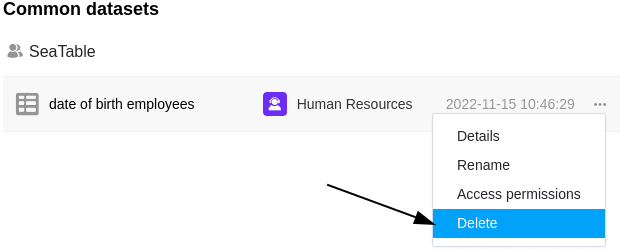

Se já não precisar dos **registos partilhados** que criou num determinado momento, pode facilmente apagá-los da página inicial em qualquer altura.

## Eliminação de um registo comum

1. Abrir a página **inicial** da SeaTable.
2. Clique no separador **Registo Partilhado**.
3. Seleccione o registo comum que pretende **apagar**.
4. Clique nos **três pontos** e depois em **Eliminar**.
5. Confirmar o processo de novo com **Delete**.

## Efeitos da eliminação

- Para quaisquer **tabelas** que utilizem dados do registo partilhado apagado, já **não existe uma opção de sincronização**.
- No entanto, os **dados do conjunto de dados comum**, que até agora constavam das tabelas correspondentes, são **retidos**.
