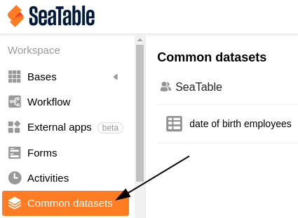
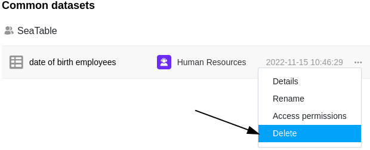

Если вам больше не нужны **общие записи**, которые вы создали в определенный момент времени, вы можете легко удалить их со стартовой страницы в любое время.

## Удаление общей записи

1. Откройте **стартовую** страницу SeaTable.
2. Перейдите на вкладку " **Общая запись"**.
3. Выберите общую запись, которую вы хотите **удалить**.
4. Нажмите на **три точки**, а затем на **Удалить**.
5. Подтвердите процесс еще раз с помощью **Delete**.

## Последствия удаления

- Для **таблиц**, использующих данные из удаленной общей записи, больше **нет возможности синхронизации**.
- Однако **данные общего набора данных**, которые до сих пор находились в соответствующих таблицах, **сохраняются**.
