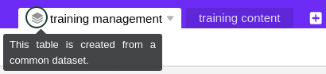
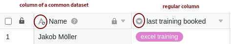

Pour utiliser un jeu de données commun dans une autre base, vous pouvez importer la vue de tableau correspondant du jeu de données commun dans la base souhaitée. Pour ce faire, créez un nouveau tableau avec le jeu de données correspondant dans la base. Vous pouvez ensuite travailler dans la base sélectionnée avec les données du jeu de données commun ou de la vue de tableau, y compris les conditions de filtrage et de tri spécifiques.

## Exigences

Pour pouvoir créer un nouveau tableau dans une base avec un jeu de données commun, la base doit remplir l'une des deux conditions suivantes :

1. La base doit appartenir au **groupe** dans lequel le jeu de données commun a été **créé**.
2. La base doit appartenir à un **groupe** auquel le jeu de données commun a été préalablement **partagé**.



## Créer un nouveau tableau avec un jeu de données commun

1. Ouvrez un **tableau** qui se trouve dans une base qui remplit l'une des **conditions** décrites ci-dessus.
2. Cliquez sur le **symbole \[+\]** pour créer un nouveau tableau.
3. Cliquez sur **Importer le jeu de données commun**.
4. Sélectionnez un **jeu de données commun**.
5. Le jeu de données commun est alors importé dans votre base en tant que **nouveau tableau**.

Si l'**importation** du jeu de données commun est **réussie**, le message suivant apparaît :

## Caractéristiques des tableaux créés avec un jeu de données commun

Vous pouvez distinguer les tableaux créés avec un jeu de données commun des autres tableaux grâce à l'**icône de pile** qui se trouve devant le nom du tableau. Si vous déplacez le curseur de la souris sur l'icône, un court **texte d'information** indique que le tableau a été créé avec un jeu de données commun.

Une autre caractéristique est le **signe** qui se trouve sur l'icône des colonnes qui contiennent des données d'un **jeu de données commun**. Les colonnes du tableau qui ne contiennent **pas** de données d'un jeu de données commun ne présentent donc **pas** cette marque sur l'icône de la colonne.

## Conséquences pour le traitement des données

La règle générale à respecter lorsque l'on travaille avec des jeux de données communs est que les informations ne circulent que dans **une seule direction**. Concrètement, cela signifie que les modifications apportées aux jeux de données communs et aux tableaux créés à l'aide d'un jeu de données commun n'ont qu'un effet unidirectionnel, à savoir vers les **tableaux**.

Si vous apportez des modifications à une vue de tableau que vous avez publiée en tant que **jeu de données commun**, ces modifications seront également appliquées à tous les tableaux créés avec le jeu de données commun correspondant. La condition préalable à cela est une **synchronisation des tableaux respectives avec le jeu de données**, [qui peut être automatique ou manuelle]().

En revanche, si vous apportez des modifications aux données du jeu de données commun dans un tableau que vous avez créée avec un jeu de données commun, ces modifications n'affectent **pas** la structure du jeu de données commun. Les modifications s'appliquent alors **exclusivement** à votre tableau et seront à nouveau **écrasées** lors de la prochaine **synchronisation** avec le jeu de données.

Ce qui reste toutefois dans votre tableau lors de la synchronisation, ce sont les **noms de colonnes modifiés**. Vous pouvez donc renommer les colonnes du jeu de données commun dans votre tableau comme vous le souhaitez.
