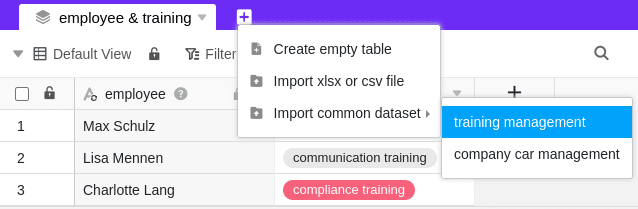

Pour utiliser un enregistrement commun dans une autre base, vous pouvez importer la vue de table correspondante de l'enregistrement commun dans la base souhaitée. Pour ce faire, créez une nouvelle table avec l'ensemble de données correspondant dans la base. Vous pouvez ensuite travailler dans la base sélectionnée avec les données de l'ensemble de données commun ou de la vue de tableau, y compris les conditions de filtrage et de tri spécifiques.

## Exigences

Pour pouvoir créer une nouvelle table dans une base avec un enregistrement commun, la base doit remplir l'une des deux conditions suivantes :

1. La base doit appartenir au **groupe** dans lequel l'ensemble de données commun a été **créé**.
2. La base doit appartenir à un **groupe** auquel l'ensemble de données commun a été préalablement **partagé**.



## Créer une nouvelle table avec un enregistrement commun

1. Ouvrez un **tableau** qui se trouve dans une base qui remplit l'une des **conditions** décrites ci-dessus.
2. Cliquez sur le **symbole \[+\]** pour créer un nouveau tableau.
3. Cliquez sur **Importer l'enregistrement commun**.
4. Sélectionnez un **enregistrement commun**.
5. L'ensemble de données commun est alors importé dans votre base en tant que **nouvelle table**.

Si l'**importation** de l'ensemble de données commun est **réussie**, le message suivant apparaît :

## Caractéristiques des tables créées avec un enregistrement commun

Vous pouvez distinguer les tableaux créés avec un enregistrement commun des autres tableaux grâce à l'**icône de pile** qui se trouve devant le nom du tableau. Si vous déplacez le curseur de la souris sur l'icône, un court **texte d'information** indique que le tableau a été créé avec un enregistrement partagé.

Une autre caractéristique est le **signe** qui se trouve sur l'icône des colonnes qui contiennent des données d'un **enregistrement commun**. Les colonnes du tableau qui ne contiennent **pas** de données d'un enregistrement commun ne présentent donc **pas** cette marque sur l'icône de la colonne.

## Conséquences pour le traitement des données

La règle générale à respecter lorsque l'on travaille avec des enregistrements partagés est que les informations ne circulent que dans **une seule direction**. Concrètement, cela signifie que les modifications apportées aux enregistrements partagés et aux tables créées à l'aide d'un enregistrement partagé n'ont qu'un effet unidirectionnel, à savoir vers les **tables**.

Si vous apportez des modifications à une vue de tableau que vous avez publiée en tant qu'**enregistrement partagé**, ces modifications seront également appliquées à toutes les tables créées avec l'enregistrement partagé correspondant. La condition préalable à cela est une **synchronisation des tables respectives avec l'ensemble de données**, [qui peut être automatique ou manuelle](https://seatable.io/fr/docs/gemeinsame-datensaetze/synchronisation-eines-gemeinsamen-datensatzes/).

En revanche, si vous apportez des modifications aux données de l'enregistrement commun dans une table que vous avez créée avec un enregistrement commun, ces modifications n'affectent **pas** la structure de l'enregistrement commun. Les modifications s'appliquent alors **exclusivement** à votre table et seront à nouveau **écrasées** lors de la prochaine **synchronisation** avec l'ensemble de données.

Ce qui reste toutefois dans votre tableau lors de la synchronisation, ce sont les **noms de colonnes modifiés**. Vous pouvez donc renommer les colonnes de l'ensemble de données commun dans votre tableau comme vous le souhaitez.
