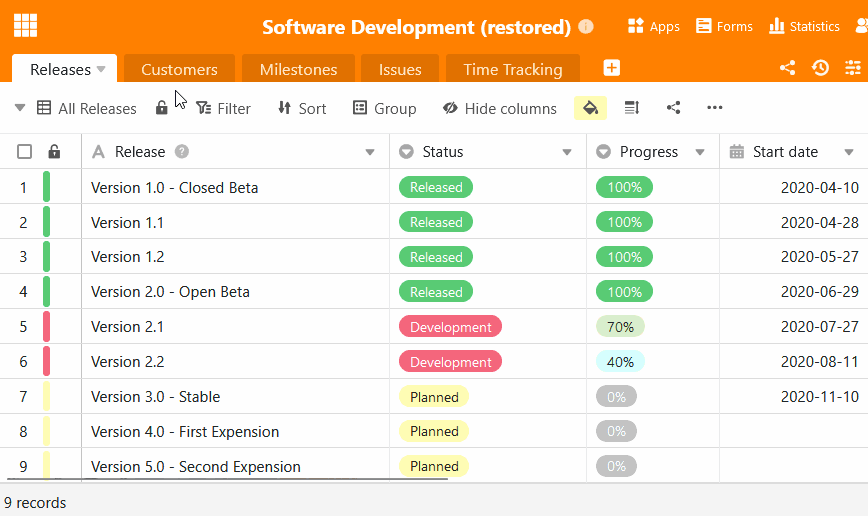

Если вы [копируете]() **базы**, в которые интегрированы записи общих данных, или [восстанавливаете их](), **связь с записями общих данных** теряется. Хотя данные затем доступны в обычной таблице, они больше не могут быть синхронизированы. Поэтому можно **повторно импортировать** записи общих данных в существующие таблицы, чтобы обеспечить **синхронизацию** с данными в них.

## Как снова связать таблицу с общей записью данных

1. Откройте **базу** и выберите **вкладку таблицы**, в которую вы хотите повторно импортировать запись общих данных.
2. Нажмите на треугольный **символ раскрывающегося списка** справа от названия таблицы.
3. Выберите опцию **Связать с общим набором данных**.
4. Выберите **запись общих данных**, с которой нужно связать таблицу.
5. Подтвердите с помощью **ссылки**.



Вы можете узнать, что таблица снова связана с общей записью данных, по **символу стека** на вкладке таблицы.

## Последствия реимпорта

- Записи, которые содержатся в таблице, но не в записи общих данных, **удаляются** из таблицы.
- Записи, содержащиеся как в таблице, так и в записи общих данных, **перезаписываются** в таблице, если с момента последней синхронизации были внесены изменения.
- Записи, которых нет в таблице, но которые содержатся в записи общих данных, **добавляются** в таблицу.
- Записи в добавленных столбцах, которые содержатся в таблице, но не в общей записи данных, остаются **неизменными**.
