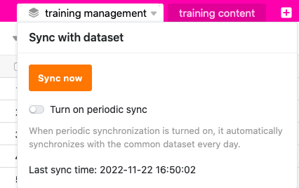
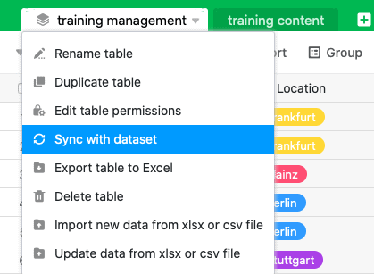

Puede **sincronizar** cualquier tabla que haya creado a partir de un conjunto de datos compartido. SeaTable sincroniza los datos del conjunto de datos compartidos con las columnas idénticas de la tabla. Los valores de estas columnas se **sobrescriben** si usted o los miembros de su grupo han realizado **cambios en el** conjunto de datos compartido desde la última sincronización.

Si desea actualizar las tablas vinculadas al registro de datos compartidos, puede **iniciar la** sincronización en **las tablas individuales por parte del usuario** (principio pull) o **forzarla para todas las tablas** (principio push), siempre que esté autorizado para ello como **creador** del registro de datos compartidos. Como usuario, puede realizar la sincronización **manualmente** en cada tabla o establecer una **sincronización periódica** automática.

## Sincronización manual con un conjunto de datos compartidos

1. Haga clic en el **icono del triángulo** situado a la derecha del nombre de una tabla creada con un registro común.
2. Haga clic en **Sincronizar con registro**.
3. Haga clic en **Sincronizar ahora**.



Si la sincronización se realiza correctamente, aparece el siguiente mensaje:

## Sincronización periódica con un conjunto de datos común

1. Haga clic en el **icono del triángulo** situado a la derecha del nombre de una tabla creada con un registro común.
2. Haga clic en **Sincronizar con registro**.
3. Haga clic en el botón **Activar sincronización automática**.
4. Seleccione si la sincronización automática debe realizarse **diariamente** o **cada hora**.

### Restricciones a la sincronización periódica

- Actualmente, la sincronización periódica automática sólo se lleva a cabo si se han realizado **cambios** en el registro de datos compartido original.
- La sincronización horaria de un conjunto de datos comunes sólo está disponible actualmente para los usuarios con una **suscripción Enterprise**.

## Forzar la sincronización de todas las tablas dependientes

1. Pase de la página de inicio a la zona de **Ficheros compartidos**.
2. Sitúe el ratón sobre el **registro de datos compartidos** que desea sincronizar y haga clic en los **tres puntos** del extremo derecho.
3. Haz clic en **Forzar sincronización**.

4. Seleccione las **bases** que desea sincronizar con el conjunto de datos compartidos.
5. Confirme con **Forzar sincronización**.

Puede utilizar esta función para asegurarse de que los demás usuarios utilizan el estado actual del conjunto de datos compartidos en sus bases. De lo contrario, deberá confiar en que los usuarios hayan activado la sincronización automática o realicen ellos mismos la sincronización de forma periódica.



## Efectos de la sincronización en la mesa

### Filas

- Las filas contenidas en la tabla pero no en el registro de datos compartidos se **eliminan** de la tabla.
- Las filas contenidas tanto en la tabla como en el registro de datos compartidos se **sobrescriben** en la tabla si se han realizado cambios desde la última sincronización.
- Las filas que no están contenidas en la tabla pero sí en el registro de datos compartidos se **añaden** a la tabla.
- Las filas que se han filtrado en el registro de datos compartidos desde la última sincronización también **desaparecen** de la tabla.

### Columnas

- Si ha **añadido nuevas columnas** al registro de datos compartidos, éstas también se **añadirán** a la tabla.
- Si **elimina columnas** del conjunto de datos compartidos, éstas permanecen en la tabla, pero los datos **dejan de estar sincronizados**.
- Si **oculta columnas** en el conjunto de datos compartidos, seguirán siendo visibles en la tabla, pero los datos **dejarán de estar sincronizados**.
- Si **se modifica el tipo de columna** en el registro de datos compartidos, también se **modificará** en la tabla.
- Si se [añaden nuevas columnas]() a la tabla que no están contenidas en el conjunto de datos compartidos, éstas **no se sincronizan** y permanecen **inalteradas**.
- Si **cambia el nombre de las columnas del conjunto de datos compartido** en la tabla, los nombres de las columnas **no se sincronizan** y permanecen **modificados**.
