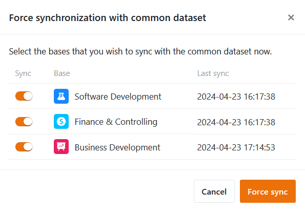

Vous pouvez **synchroniser** chaque tableau que vous avez créé à partir d'un ensemble de données commun. SeaTable compare alors les données de l'enregistrement partagé avec les colonnes identiques du tableau. Les valeurs de ces colonnes sont **écrasées** si vous ou les membres de votre groupe avez **apporté des modifications à l'enregistrement partagé** depuis la dernière synchronisation.

Si vous souhaitez mettre à jour les tables liées à l'ensemble de données commun, vous pouvez **déclencher** la synchronisation **côté utilisateur dans les différentes tables** (principe "pull") ou **la forcer pour toutes les tables** (principe "push"), à condition que vous y soyez autorisé en tant que **créateur** de l'ensemble de données commun. En tant qu'utilisateur, vous pouvez effectuer la synchronisation **manuellement** dans chaque table ou configurer une **synchronisation périodique** automatique.

## Synchronisation manuelle avec un ensemble de données commun

1. Cliquez sur l'**icône en forme de triangle** à droite du nom d'une table créée avec un enregistrement partagé.
2. Cliquez sur **Synchroniser avec l'ensemble de données**.
3. Cliquez sur **Synchroniser maintenant**.



Si la synchronisation est réussie, le message suivant s'affiche :

## Synchronisation périodique avec un ensemble de données commun

1. Cliquez sur l'**icône en forme de triangle** à droite du nom d'une table créée avec un enregistrement partagé.
2. Cliquez sur **Synchroniser avec l'ensemble de données**.
3. Cliquez sur le bouton **Activer la synchronisation automatique**.
4. Choisissez si la synchronisation automatique doit être effectuée **quotidiennement** ou **toutes les heures**.

### Limitations de la synchronisation périodique

- Actuellement, la synchronisation périodique automatique n'est effectuée que si **des modifications ont été apportées** à l'ensemble de données commun initial.
- La synchronisation horaire d'un ensemble de données commun n'est actuellement disponible que pour les utilisateurs ayant **souscrit un abonnement Enterprise**.

## Forcer la synchronisation de toutes les tables dépendantes

1. Passez de la page d'accueil à la section **Enregistrements communs**.
2. Passez la souris sur l'**ensemble de données commun** que vous souhaitez synchroniser et cliquez tout à droite sur les **trois points**.
3. Cliquez sur **Forcer la synchronisation**.

5. Sélectionnez les **bases** que vous souhaitez synchroniser avec l'ensemble de données commun.
6. Confirmez en cliquant sur **Forcer la synchronisation**.

Cette fonction vous permet de vous assurer que les autres utilisateurs utilisent dans leurs bases l'état actuel de l'ensemble de données commun. Sinon, vous devez vous fier au fait que les utilisateurs ont activé la synchronisation automatique ou qu'ils effectuent eux-mêmes la synchronisation régulièrement.



## Effets de la synchronisation sur le tableau

### Lignes

- Les lignes contenues dans la table mais pas dans l'enregistrement commun sont **supprimées** de la table.
- Les lignes contenues à la fois dans la table et dans l'enregistrement partagé sont **écrasées** dans la table si des modifications ont été apportées depuis la dernière synchronisation.
- Les lignes qui ne figurent pas dans la table mais qui sont contenues dans l'enregistrement commun sont **ajoutées** à la table.
- Les lignes qui ont été filtrées dans l'ensemble de données commun depuis la dernière synchronisation **disparaissent** également dans le tableau.

### Colonnes

- Si vous avez **ajouté de nouvelles colonnes** dans l'ensemble de données partagé, elles seront également **ajoutées** dans le tableau.
- Si vous **supprimez des colonnes** de l'ensemble de données commun, celles-ci sont conservées dans la table, mais les données ne sont **plus synchronisées**.
- Si vous **masquez des colonnes** dans l'ensemble de données commun, elles restent visibles dans le tableau, mais les données ne sont **plus synchronisées**.
- Si vous **modifiez le type de colonne** dans l'enregistrement partagé, il sera également **modifié** dans la table.
- Si vous [ajoutez](https://seatable.io/fr/docs/gemeinsame-datensaetze/eine-mit-einem-gemeinsamen-datensatz-erstellte-tabelle-um-spalten-erweitern/) dans la table de [nouvelles colonnes](https://seatable.io/fr/docs/gemeinsame-datensaetze/eine-mit-einem-gemeinsamen-datensatz-erstellte-tabelle-um-spalten-erweitern/) qui ne sont pas incluses dans l'ensemble de données commun, elles ne seront **pas synchronisées** et resteront **inchangées**.
- Si vous **renommez des colonnes de l'enregistrement commun** dans le tableau, les noms des colonnes ne sont **pas synchronisés** et restent **modifiés**.
