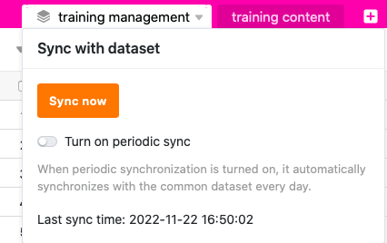
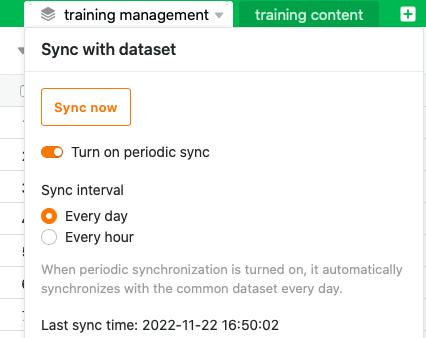
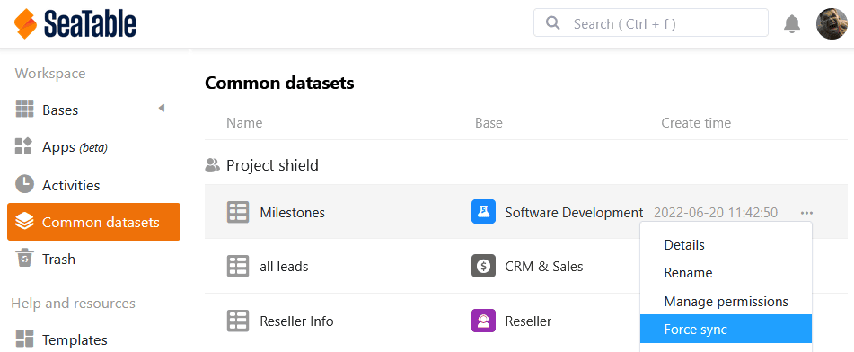
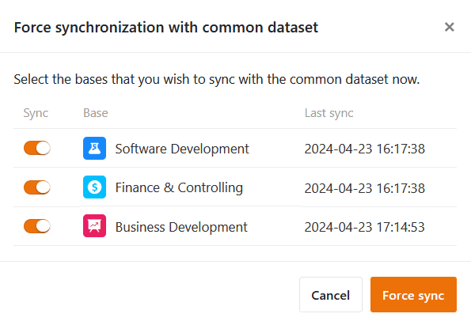

Pode **sincronizar** qualquer tabela que tenha criado a partir de um conjunto de dados partilhado. O SeaTable sincroniza os dados do conjunto de dados partilhados com as colunas idênticas na tabela. Os valores nestas colunas são **substituídos** se você ou os membros do seu grupo tiverem feito **alterações no** conjunto de dados partilhado desde a última sincronização.

Se quiser atualizar as tabelas ligadas ao registo de dados partilhados, pode **iniciar** a sincronização **nas tabelas individuais do lado do utilizador** (princípio pull) ou **forçá-la para todas as tabelas** (princípio push), desde que esteja autorizado a fazê-lo como **criador do** registo de dados partilhados. Como utilizador, pode executar a sincronização **manualmente** em cada tabela ou definir uma **sincronização periódica** automática.

## Sincronização manual com um conjunto de dados partilhados

1. Clique no **ícone do triângulo** à direita do nome de uma tabela criada com um registo comum.
2. Clique em **Sincronizar com registo**.
3. Clique em **Synchronise Now (Sincronizar agora)**.



Se a sincronização for bem sucedida, aparece a seguinte mensagem:

## Sincronização periódica com um conjunto de dados comum

1. Clique no **ícone do triângulo** à direita do nome de uma tabela criada com um registo comum.
2. Clique em **Sincronizar com registo**.
3. Clique no botão **Activate automatic synchronisation (Activar sincronização automática**).
4. Seleccionar se a sincronização automática deve ser realizada **diariamente** ou **de hora a hora**.

### Restrições à sincronização periódica

- Atualmente, a sincronização periódica automática só é efectuada se tiverem sido feitas **alterações** ao registo de dados partilhados original.
- A sincronização horária de um conjunto de dados comum só está actualmente disponível para utilizadores com uma **assinatura Enterprise**.

## Forçar a sincronização de todas as tabelas dependentes

1. Mudar da página inicial para a área **de registos de dados partilhados**.
2. Mova o rato sobre o **registo de dados partilhados** que pretende sincronizar e clique nos **três pontos** na extrema direita.
3. Clique em **Forçar sincronização**.

5. Seleccione as **bases** que pretende sincronizar com o conjunto de dados partilhados.
6. Confirmar com **Forçar sincronização**.

Esta função pode ser utilizada para garantir que os outros utilizadores utilizem o estado atual do conjunto de dados partilhados nas suas bases. Caso contrário, é necessário contar que os utilizadores tenham ativado a sincronização automática ou que eles próprios efectuem a sincronização regularmente.



## Efeitos da sincronização no quadro

### Linhas

- As linhas que estão contidas na tabela mas não no registo de dados partilhados são **eliminadas** da tabela.
- As linhas que estão contidas tanto na tabela como no registo de dados partilhados são **substituídas** na tabela se tiverem sido feitas alterações desde a última sincronização.
- As linhas que não estão contidas na tabela mas que estão contidas no registo de dados partilhados são **adicionadas** à tabela.
- As linhas que foram filtradas no registo de dados partilhados desde a última sincronização também **desaparecem** da tabela.

### Colunas

- Se tiver **adicionado novas colunas** ao registo de dados partilhados, estas também são **adicionadas** à tabela.
- Se **eliminar colunas** do conjunto de dados partilhados, estas permanecem na tabela, mas os dados deixam de ser **sincronizados**.
- Se **ocultar colunas** no conjunto de dados partilhados, estas permanecem visíveis na tabela, mas os dados deixam de ser **sincronizados**.
- Se **o tipo de coluna** for modificado no registo de dados partilhados, este também é **modificado** na tabela.
- Se [adicionar novas colunas]() à tabela que não estejam contidas no conjunto de dados partilhados, estas **não** são **sincronizadas** e permanecem **inalteradas**.
- Se **renomear colunas do conjunto de dados partilhados** na tabela, os nomes das colunas **não** são **sincronizados** e permanecem **alterados**.
