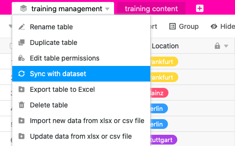

Jede Tabelle, die Sie aus einem gemeinsamen Datensatz erstellt haben, können Sie **synchronisieren**. Dabei gleicht SeaTable die Daten des gemeinsamen Datensatzes mit den identischen Spalten in der Tabelle ab. Die Werte in diesen Spalten werden **überschrieben**, falls Sie oder Ihre Gruppenmitglieder seit der letzten Synchronisation **Veränderungen am gemeinsamen Datensatz** vorgenommen haben.

Wenn Sie die mit dem gemeinsamen Datensatz verknüpften Tabellen auf den neuesten Stand bringen wollen, können Sie die Synchronisation sowohl **nutzerseitig in den einzelnen Tabellen anstoßen** (Pull-Prinzip) als auch **für alle Tabellen erzwingen** (Push-Prinzip), sofern Sie als **Ersteller** des gemeinsamen Datensatzes dazu berechtigt sind. Als Nutzer können Sie die Synchronisation in jeder Tabelle **manuell** durchführen oder auch eine automatische **periodische Synchronisation** einstellen.

## Manuelle Synchronisation mit einem gemeinsamen Datensatz

1. Klicken Sie auf das **Dreieck-Symbol** rechts neben dem Namen einer Tabelle, die mit einem gemeinsamen Datensatz erstellt wurde.
2. Klicken Sie auf **Mit Datensatz synchronisieren**.
3. Klicken Sie auf **Jetzt synchronisieren**.



Bei einer erfolgreichen Synchronisation erscheint folgende Meldung:

## Periodische Synchronisation mit einem gemeinsamen Datensatz

1. Klicken Sie auf das **Dreieck-Symbol** rechts neben dem Namen einer Tabelle, die mit einem gemeinsamen Datensatz erstellt wurde.
2. Klicken Sie auf **Mit Datensatz synchronisieren**.
3. Klicken Sie auf den Schalter **Automatische Synchronisation aktivieren**.
4. Wählen Sie aus, ob die automatische Synchronisation **täglich** oder **stündlich** durchgeführt werden soll.

### Einschränkungen der periodischen Synchronisation

- Die automatische periodische Synchronisation wird aktuell nur vollzogen, wenn am ursprünglichen gemeinsamen Datensatz **Änderungen** vorgenommen wurden.
- Die stündliche Synchronisation eines gemeinsamen Datensatzes steht aktuell ausschließlich Nutzern mit einem **Enterprise-Abo** zur Verfügung.

## Synchronisation aller abhängigen Tabellen erzwingen

1. Wechseln Sie von der Startseite in den Bereich **Gemeinsame Datensätze**.
2. Fahren Sie mit der Maus über den **gemeinsamen Datensatz**, den Sie synchronisieren möchten, und klicken Sie ganz rechts auf die **drei Punkte**.
3. Klicken Sie auf **Sync erzwingen**.

5. Wählen Sie die **Bases** aus, die Sie mit dem gemeinsamen Datensatz synchronisieren wollen.
6. Bestätigen Sie mit **Sync erzwingen**.

Mit dieser Funktion können Sie sicherstellen, dass die anderen Nutzer in ihren Bases den aktuellen Stand des gemeinsamen Datensatzes verwenden. Ansonsten müssen Sie darauf vertrauen, dass die Benutzer die automatische Synchronisation aktiviert haben oder die Synchronisation regelmäßig selbst durchführen.



## Auswirkungen der Synchronisation auf die Tabelle

### Zeilen

- Zeilen, die in der Tabelle, nicht aber im gemeinsamen Datensatz enthalten sind, werden aus der Tabelle **gelöscht**.
- Zeilen, die sowohl in der Tabelle als auch im gemeinsamen Datensatz enthalten sind, werden in der Tabelle **überschrieben**, sofern seit der letzten Synchronisation Änderungen vorgenommen wurden.
- Zeilen, die nicht in der Tabelle, wohl aber im gemeinsamen Datensatz enthalten sind, werden in der Tabelle **hinzugefügt**.
- Zeilen, die seit der letzten Synchronisation im gemeinsamen Datensatz herausgefiltert wurden, **verschwinden** auch in der Tabelle.

### Spalten

- Wenn Sie im gemeinsamen Datensatz **neue Spalten hinzugefügt** haben, werden diese auch in der Tabelle **hinzugefügt**.
- Wenn Sie aus dem gemeinsamen Datensatz **Spalten löschen**, bleiben diese in der Tabelle erhalten, die Daten werden aber **nicht mehr synchronisiert**.
- Wenn Sie im gemeinsamen Datensatz **Spalten ausblenden**, bleiben diese in der Tabelle sichtbar, die Daten werden aber **nicht mehr synchronisiert**.
- Wenn Sie im gemeinsamen Datensatz **den Spaltentyp ändern**, wird dieser auch in der Tabelle **geändert**.
- Wenn Sie in der Tabelle [neue Spalten hinzufügen](), die nicht im gemeinsamen Datensatz enthalten sind, werden diese **nicht synchronisiert** und bleiben **unverändert**.
- Wenn Sie in der Tabelle **Spalten des gemeinsamen Datensatzes umbenennen**, werden die Spaltennamen **nicht synchronisiert** und bleiben **geändert**.
