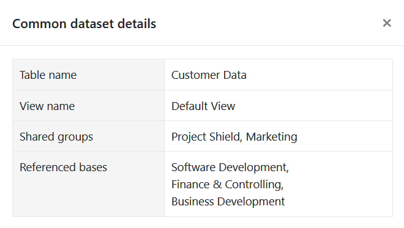

Once you have created a common dataset, you can perform various operations to manage your data set. You can access the overview of your common datasets via the start page.

## How to manage your common datasets

1. Open the **home page** of SeaTable.

2. Click on **common dataset**. You are now in the **overview** of all common datasets.
3. Move the mouse over a common dataset and click on the **three dots** on the far right.
4. Select the desired option in the following menu.



## Retrieve details of a common dataset

If you use common datasets extensively in your team, it can be easy to lose track. With which **groups** is a common dataset shared and in which **bases** is it integrated? You can view this information under **Details**.

## Rename a common dataset

If you want to change the **name** of your common dataset, simply click on **Rename**.

Enter the new name and confirm with **Send**.

## Manage access authorizations

You can use the **Manage access** option to share your common dataset with another group or withdraw access again. You can find out exactly how this works [here]().

## Force synchronization with the common dataset

As the creator of a common dataset, you can force the **synchronization** of dependent tables. You can find out the consequences and advantages of this [here]().

## Delete a common dataset

If you want to delete a common dataset, you will find all the important information [here]().
