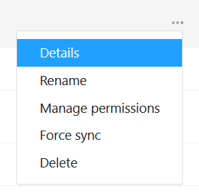
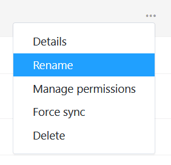
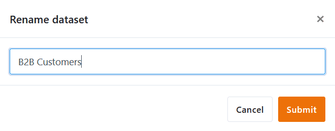

Une fois que vous avez créé un jeu de données commun, vous pouvez effectuer différentes opérations pour gérer votre jeu de données. Vous pouvez accéder à l'aperçu de vos jeux de données communs via la page d'accueil.

## Comment gérer vos jeux de données communs

1. Ouvrez la **page d'accueil** de SeaTable.

2. Cliquez sur **Jeux de données communs**. Vous vous trouvez maintenant dans l'**aperçu** de tous les jeux de données communs.
3. Passez la souris sur un jeu de données commun et cliquez à l'extrême droite sur les **trois points**.
4. Sélectionnez l'option souhaitée dans le menu suivant.



## Obtenir les détails d'un jeu de données commun

Si vous utilisez beaucoup de jeux de données communs dans votre équipe, vous risquez de perdre rapidement la vue d'ensemble. À quels **groupes** un jeu de données commun est-il partagé et dans quelles **bases** est-il intégré ? Vous pouvez consulter ces informations sous **Détails**.

## Renommer un jeu de données commun

Si vous souhaitez modifier le **nom** de votre jeu de données commun, il vous suffit de cliquer sur **Renommer**.

Saisissez le nouveau nom et confirmez en cliquant sur **Envoyer**.

## Gérer les droits d'accès

L'option **Gérer l'accès** vous permet de partager votre jeu de données commun avec un autre groupe ou de lui retirer l'accès. Pour savoir comment cela fonctionne exactement, [cliquez ici]().

## Forcer la synchronisation avec le jeu de données commun

En tant que créateur d'un jeu de données commun, vous pouvez forcer la **synchronisation** des tableaux dépendants. Vous découvrirez [ici]() les conséquences et les avantages de cette démarche.

## Supprimer un jeu de données commun

Si vous souhaitez supprimer un jeu de données commun, vous trouverez [ici]() toutes les informations utiles.
