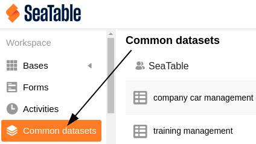
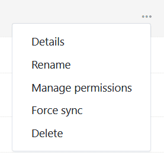
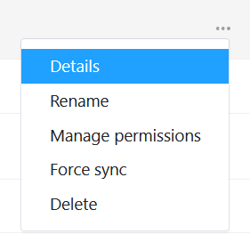
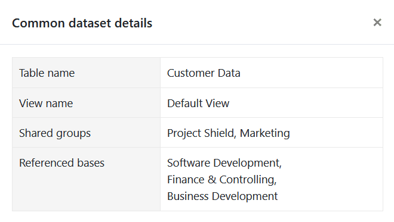
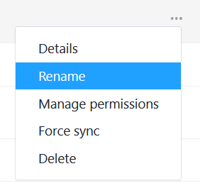
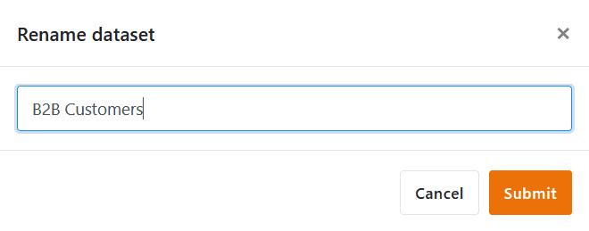

После создания записи общих данных вы можете выполнять различные операции по управлению записью данных. Вы можете получить доступ к обзору записей общих данных на стартовой странице.

## Как управлять записями общих данных

1. Откройте **стартовую** страницу SeaTable.

3. Нажмите на " **Общая запись данных"**. Теперь вы находитесь в **обзоре** всех записей общих данных.
4. Наведите курсор на запись общих данных и нажмите на **три точки** в крайнем правом углу.
5. Выберите нужную опцию в следующем меню.



## Получение сведений об общей записи данных

Если вы широко используете общие наборы данных в своей команде, можно легко сбиться со счета. Для каких **групп** выпущена запись общих данных и в какие **базы** она интегрирована? Эту информацию можно просмотреть в разделе **Подробности**.

## Переименование общего набора данных

Если вы хотите изменить **название** записи общих данных, просто нажмите " **Переименовать**".

Введите новое имя и подтвердите его нажатием кнопки **Отправить**.

## Управление полномочиями доступа

Вы можете воспользоваться опцией " **Управление доступом** ", чтобы передать запись общих данных другой группе или снова отозвать доступ. Как именно это работает, вы можете узнать [здесь](https://seatable.io/ru/docs/gemeinsame-datensaetze/freigabe-eines-gemeinsamen-datensatzes-an-eine-andere-gruppe/).

## Принудительная синхронизация с общим набором данных

Как создатель общей записи данных, вы можете принудительно **синхронизировать** зависимые таблицы. Ознакомиться с последствиями и преимуществами этого можно [здесь](https://seatable.io/ru/docs/gemeinsame-datensaetze/synchronisation-eines-gemeinsamen-datensatzes/).

## Удаление записи общих данных

Если вы хотите удалить запись общих данных, [здесь](https://seatable.io/ru/docs/gemeinsame-datensaetze/loeschen-eines-gemeinsamen-datensatzes/) вы найдете всю важную информацию.
