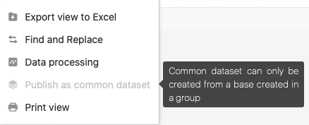

Os conjuntos de dados partilhados **só** podem até agora ser criados a partir de pontos de vista de bases de grupos. Isto deve-se a uma **limitação técnica** que pode ser removida numa futura versão do SeaTable.

## Nota por texto informativo

Esta circunstância é também referida por um pequeno **texto informativo** que aparece assim que se pretende publicar um registo comum a partir de uma vista de tabela a partir de uma base que **não** pertence a um grupo.

## Contornar a limitação

Para poder criar um registo comum a partir de uma visão de tabela de uma base que **não** pertence a um grupo, há uma forma simples de contornar a limitação técnica acima descrita:

1. [Copiar a base correspondente em qualquer grupo.]()
2. [Criar um registo comum a partir da vista desejada.]()
