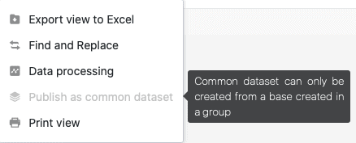

Общие наборы данных пока можно создавать **только** из представлений групповых баз. Это связано с **техническим ограничением**, которое может быть устранено в будущей версии SeaTable.

## Примечание к информационному тексту

Это обстоятельство также обозначается коротким **информационным текстом**, который появляется, как только вы хотите опубликовать общую запись из табличного представления из базы, **не** принадлежащей группе.

## Ограничение байпаса

Чтобы иметь возможность создать общую запись из табличного представления базы, которая **не** принадлежит к группе, существует простой способ обойти техническое ограничение, описанное выше:

1. [Скопируйте соответствующую базу в любую группу.]()
2. [Создайте общую запись из нужного представления.]()
