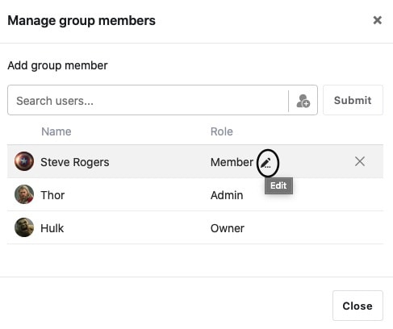
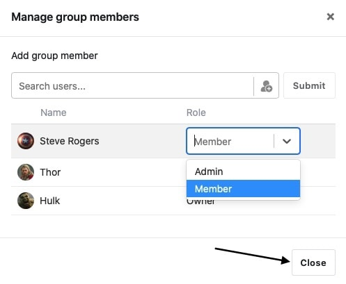

Dentro de un grupo SeaTable, puede asignar permisos asignando un rol específico a los miembros del grupo. Hay que distinguir entre los roles de **propietario**, **administrador** y **miembro**, que tienen [permisos]() diferentes.

Es importante tener en cuenta que sólo como **propietario** o **administrador de** un grupo puedes cambiar los permisos de los demás miembros. Aquí puedes ver cómo asignar permisos en un grupo:

## Asignación de permisos en un grupo

1. Cambie a la página de **inicio** de SeaTable.
2. Haga clic en el **símbolo del triángulo** situado a la derecha del nombre del grupo al que desea asignar permisos.
3. Vaya a **Gestionar miembros**.

5. Para editar, haga clic en el **icono del lápiz situado** a la derecha de la función actual del miembro del grupo correspondiente.

7. Seleccione la **función** que desea asignar al usuario correspondiente haciendo clic en el cuadro de selección.
8. Confirme su selección haciendo clic en el campo **Cerrar**.


