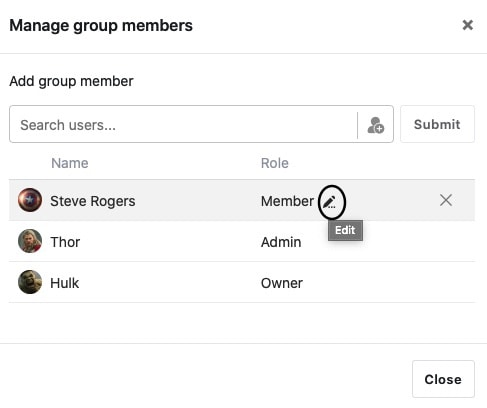

Dentro de um grupo SeaTable, pode atribuir permissões, atribuindo um papel específico aos membros do grupo. Deve ser feita uma distinção entre os papéis de **proprietário**, **administrador** e **membro**, que têm todos [permissões]() diferentes.

É importante notar que apenas como **proprietário** ou **administrador de** um grupo pode alterar as permissões dos outros membros. Aqui pode descobrir como atribuir permissões num grupo:

## Atribuição de permissões num grupo

1. Mudar para a página **inicial** da SeaTable.
2. Clique no **símbolo do triângulo** à direita do nome do grupo para o qual pretende atribuir permissões.
3. Ir para **Gerir Membros**.

5. Para editar, clicar no **ícone do lápis** à direita do papel actual do respectivo membro do grupo.

7. Seleccione a **função** que pretende atribuir ao respectivo utilizador clicando na caixa de selecção.
8. Confirme a sua selecção clicando no campo **Fechar**.



Se já não tiver a certeza de qual dos três papéis tem quais as permissões, este [quadro sobre as permissões dos papéis]() ajudá-lo-á.


