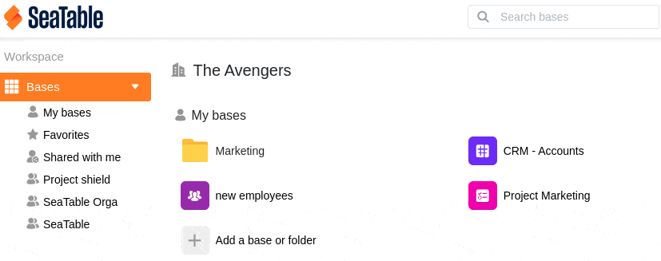

Para personalizar su espacio de trabajo, tiene la opción de cambiar el orden en el que aparecen sus grupos en la página de inicio de SeaTable. Aprende a cambiar el orden de los grupos aquí:

## Cambia el orden de los grupos:

1. Cambie a la página de **inicio** de SeaTable.
2. Haga clic en el **símbolo del triángulo** situado a la derecha del área de trabajo **Bases**, a la izquierda.
3. En el menú desplegable que se abre, verás ahora tus **grupos**, así como los espacios de trabajo **Mis bases**, **Favoritos** y **Compartidos conmigo.**
4. Para cambiar el orden de los grupos, basta con **arrastrar y soltar** cualquier grupo a la posición deseada. Para ello, utilice los **seis puntos** situados a la **derecha de cada grupo**.


