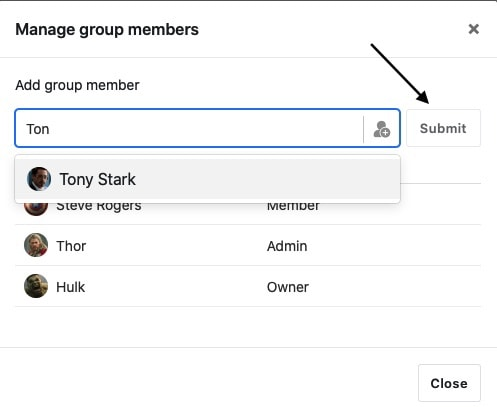
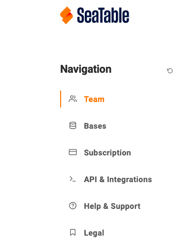
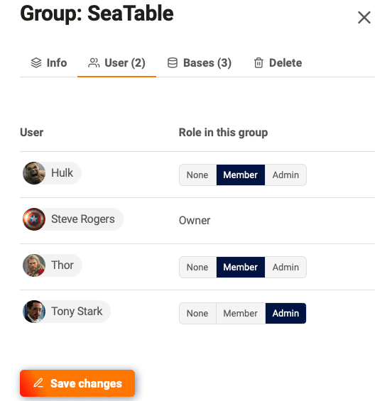

Eigentümer und Administratoren einer Gruppe können Mitglieder hinzufügen, entfernen sowie die Berechtigungen bestehender Gruppenmitglieder ändern. In diesem Artikel lernen Sie die zwei Arten kennen, wie Sie Teammitglieder zu einer Gruppe hinzufügen können.

## Teammitglieder direkt hinzufügen

1. Gehen Sie auf die **Startseite** von SeaTable.
2. Klicken Sie auf das **Dreieck-Symbol** rechts neben dem Gruppennamen.
3. Wählen Sie die Option **Mitglieder verwalten** aus.

 5. Geben Sie den Namen in das **Suchfeld** ein. 6. Bestätigen Sie mit **Absenden**.



### Was, wenn Sie die Person nicht finden?

Wenn Sie die gewünschte Person nicht finden, genauer gesagt die Autovervollständigung Ihnen die gewünschte Person nicht vorschlägt, liegt das sehr wahrscheinlich daran, dass diese Person nicht Teil Ihres Teams ist. In diesem Fall kann dieser andere Nutzer von SeaTable nicht zu Ihrer Gruppe hinzugefügt werden. Nur mithilfe eines Einladungslinks können Sie eine Base an diese Person freigeben und so zusammenarbeiten.

## Teammitglieder in der Teamverwaltung hinzufügen

Teammitglieder mit einer Administratorberechtigung haben zusätzlich noch die Möglichkeit, in der Teamverwaltung alle Gruppen und deren Mitglieder zu verwalten. Der Vorteil der Teamverwaltung ist, dass Sie gleichzeitig die Gruppenmitgliedschaft und die jeweiligen Berechtigungen ändern können.

1. Wechseln Sie zur **Startseite** von SeaTable.
2. Klicken Sie rechts oben auf Ihr **Avatar-Bild** und dann auf **Teamverwaltung**.

 4. Wechseln Sie in den Bereich **Team** und dort auf den Reiter **Gruppen**.

 6. Suchen Sie die Gruppe, deren Mitglieder Sie bearbeiten möchten, und klicken Sie auf diese Zeile.

 8. Wechseln Sie in dem sich öffnenden Seitenmenü in den Reiter **Mitglieder**. 9. Suchen Sie die Teammitglieder, die Sie der Gruppe hinzufügen möchten. 10. Ändern Sie die Rolle von **Keine** auf **Mitglied** oder **Admin** und **speichern** Sie Ihre Änderungen.

