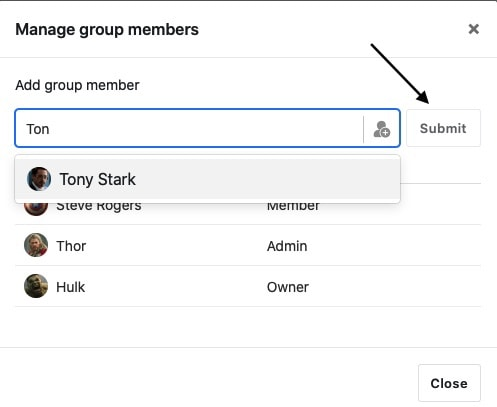

Os proprietários e administradores de um grupo podem adicionar e remover membros, bem como alterar as permissões dos membros existentes do grupo. Neste artigo aprenderá as duas formas de adicionar membros de equipa a um grupo.

## Adicionar directamente os membros da equipa

1. Ir para a **página inicial do** SeaTable.
2. Clique no **símbolo do triângulo** à direita do nome do grupo.
3. Seleccionar a opção **Gerir Membros**.

5. Introduzir o nome no **campo de pesquisa**.
6. Confirmar com **Submeter**.



### E se não encontrar a pessoa?

Se não encontrar a pessoa que procura, ou mais precisamente, o autocompletar não sugere a pessoa que procura, é muito provável que seja porque essa pessoa não faz parte da sua equipa. Neste caso, este outro utilizador de SeaTable não pode ser adicionado ao seu grupo. Apenas através de um link de convite pode partilhar uma base com esta pessoa e colaborar.

## Adicionar membros da equipa na gestão da equipa

Os membros da equipa com autorização do administrador também têm a opção de gerir todos os grupos e os seus membros na administração da equipa. A vantagem da administração da equipa é que se pode alterar a composição do grupo e as respectivas autorizações ao mesmo tempo.

1. Mudar para a página **inicial** da SeaTable.
2. Clique na **imagem do** seu **avatar** no canto superior direito e depois em **Gestão de Equipas**.

4. Mudar para a área de **Equipa** e lá para a tabulação **Grupos**.

6. Encontre o grupo cujos membros deseja editar e clique nesta linha.

8. No menu lateral que se abre, mudar para a tabulação **Membros**.
9. Encontre os membros da equipa que deseja acrescentar ao grupo.
10. Altere a função de **Nenhum** para **Membro** ou **Administrador** e **guarde** as suas alterações.

