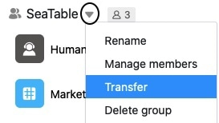
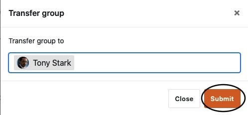

Bestehende Gruppen können in SeaTable vom Eigentümer an einen anderen Benutzer übertragen werden. In diesem Fall wird der ausgewählte Benutzer zum neuen Eigentümer der Gruppe, während der ursprüngliche Eigentümer ab sofort nur noch als Mitglied fungiert. Hier erfahren Sie, wie Sie eine Gruppe an einen anderen Benutzer übertragen können.

## Eine Gruppe an einen anderen Benutzer übertragen

1. Wechseln Sie zur **Startseite** von SeaTable.
2. Klicken Sie auf das **Dreieck-Symbol** rechts neben dem Namen der Gruppe, die Sie an einen anderen Benutzer übertragen möchten.
3. Klicken Sie auf **Übertragen**.

 5. Geben Sie den **Namen** des gewünschten **Benutzers** ein und wählen Sie diesen aus.

 7. Bestätigen Sie mit **Absenden**.

