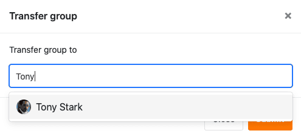

Existing groups can be transferred from the owner to another user in SeaTable. In this case, the selected user becomes the new owner of the group, while the original owner from now on acts only as a member. Here you can learn how to transfer a group to another user.

## Transfer a group to another user

1. Switch to the SeaTable **home** page.
2. Click the **triangle icon to** the right of the name of the group you want to transfer to another user.
3. Click **Transfer**.

5. Enter the **name of** the desired **user** and select it.

7. Confirm with **Submit**.

