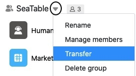
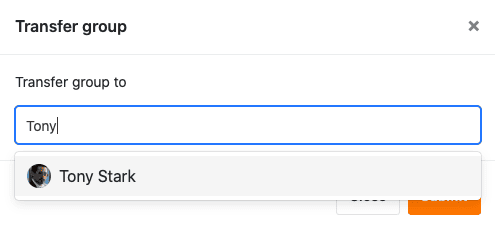
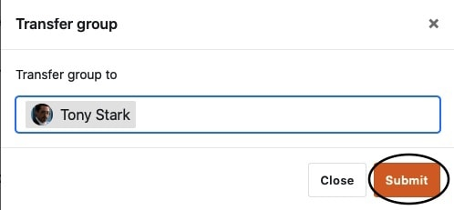

Dans SeaTable, les groupes existants peuvent être transférés de leur propriétaire à un autre utilisateur. Dans ce cas, l'utilisateur sélectionné devient le nouveau propriétaire du groupe, tandis que le propriétaire d'origine n'est désormais plus qu'un membre. Vous trouverez ici des informations sur la manière de transférer un groupe à un autre utilisateur.

## Transférer un groupe à un autre utilisateur

1. Passez à la **page d'accueil** de SeaTable.
2. Cliquez sur l'**icône en forme de triangle** à droite du nom du groupe que vous souhaitez transférer à un autre utilisateur.
3. Cliquez sur **Transférer**.

5. Saisissez le **nom** de l'**utilisateur** souhaité et sélectionnez-le.

7. Confirmez en cliquant sur **Envoyer**.

