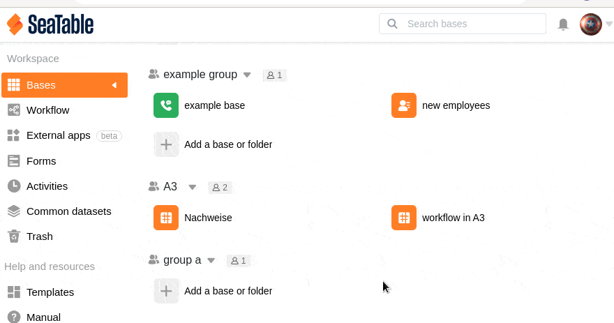

Los grupos que ya no están activos o que ya no son necesarios por otras razones pueden ser simplemente eliminados por el propietario. Sin embargo, los administradores y los miembros del grupo no están autorizados a hacerlo.

## Eliminar un grupo en SeaTable

1. Cambie a la página de **inicio** de SeaTable.
2. Haga clic en el **símbolo del triángulo** situado a la derecha del grupo que desea eliminar.
3. Haga clic en **Eliminar Grupo**.
4. Confirme con **Borrar**.


