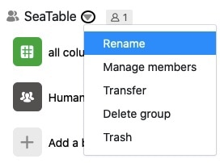

Existing groups in SeaTable can be renamed by their owner at any time. Group administrators and group members, however, are not allowed to do so.  
Here you will learn how you as the owner can edit the name of a group.

## Edit group names in SeaTable

1. Switch to the SeaTable **home** page.
2. Click the **triangle icon to** the right of the group name you want to change.
3. Click **Rename**.

5. Enter any name you like.
6. Confirm with **Submit**.


