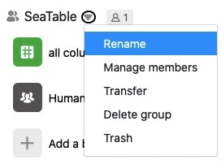
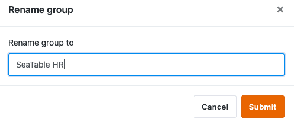

Los grupos existentes en SeaTable pueden ser renombrados por su propietario en cualquier momento. Los administradores y miembros de grupos, sin embargo, no están autorizados a hacerlo.  
Aquí puede averiguar cómo usted, como propietario, puede editar el nombre de un grupo.

## Editar nombres de grupo en SeaTable

1. Cambie a la página de **inicio** de SeaTable.
2. Haga clic en el **símbolo del triángulo** situado a la derecha del nombre del grupo que desea modificar.
3. Haga clic en **Cambiar el nombre**.

5. Introduzca cualquier nombre.
6. Confirme con **Enviar**.


