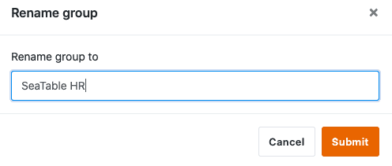

Os grupos existentes no SeaTable podem ser renomeados pelo seu proprietário em qualquer altura. No entanto, os administradores e os membros do grupo não estão autorizados a fazê-lo.  
Aqui pode descobrir como pode, enquanto proprietário, editar o nome de um grupo.

## Editar nomes de grupos em SeaTable

1. Mudar para a página **inicial** da SeaTable.
2. Clique no **símbolo do triângulo** à direita do nome do grupo que pretende alterar.
3. Clique em **Renomear**.

5. Digite qualquer nome.
6. Confirmar com **Submeter**.


